# lk_irrigation 🇱🇰

Realtime Data about *River Water Levels* in Sri Lanka, from the [Irrigation Deptartment](https://www.irrigation.gov.lk)'s [Hydrology and Disaster Management](https://www.irrigation.gov.lk/web/index.php?option=com_content&view=article&id=27&Itemid=128&lang=en) Division.

- [Complete Dataset](data/rwlds) with **74,274 measurements** from **39** stations.
- [Scrape and load logic](src/lk_irrigation/rwld/RiverWaterLevelDataLoadMixin.py)
- [Original Data source](https://www.arcgis.com/apps/dashboards/2cffe83c9ff5497d97375498bdf3ff38)

## River Water Level Map

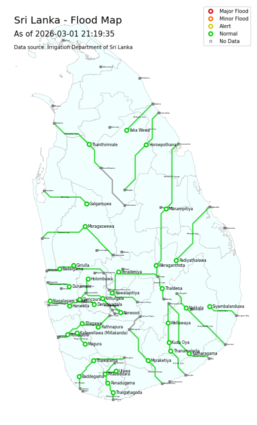

## Latest measurements

*There were **32** measurements in the last **1 hour**.*

| Measured At | Station (River Basin) | Level (m) | Alert Level | Rate-of-Rise (m/hr) | Rising Alert |
| --- | --- | ---: | --- | ---: | --- |
| 2026-02-16 04:28:48 | Baddegama (Gin Ganga) | 1.12 | 🟢 Normal | -0.050 |  |
| 2026-02-16 04:26:41 | Thawalama (Gin Ganga) | 1.12 | 🟢 Normal | -0.017 |  |
| 2026-02-16 04:17:53 | Manampitiya (Mahaweli Ganga) | 1.60 | 🟢 Normal | 0.000 |  |
| 2026-02-16 04:17:41 | Panadugama (Nilwala Ganga) | 2.03 | 🟢 Normal | 0.000 |  |
| 2026-02-16 04:17:11 | Manampitiya (Mahaweli Ganga) | 1.60 | 🟢 Normal | 0.000 |  |
| 2026-02-16 04:13:40 | Thalgahagoda (Nilwala Ganga) | 0.33 | 🟢 Normal | 0.011 | 🔺 Rising |
| 2026-02-16 04:11:21 | Nagalagam Street (Kelani Ganga) | 0.61 | 🟢 Normal | 0.000 |  |
| 2026-02-16 04:07:35 | Thanamalwila (Kirindi Oya) | 0.57 | 🟢 Normal | 0.005 |  |
| 2026-02-16 04:06:33 | Kithulgala (Kelani Ganga) | 1.50 | 🟢 Normal | 0.346 | 🔺 Rising |
| 2026-02-16 04:06:30 | Moraketiya (Walawe Ganga) | 0.90 | 🟢 Normal | 0.000 |  |
| 2026-02-16 04:06:18 | Holombuwa (Kelani Ganga) | 0.29 | 🟢 Normal | -0.011 |  |
| 2026-02-16 04:06:12 | Urawa (Nilwala Ganga) | 0.05 | 🟢 Normal | 0.004 |  |
| 2026-02-16 04:06:08 | Glencourse (Kelani Ganga) | 8.49 | 🟢 Normal | 0.107 | 🔺 Rising |
| 2026-02-16 04:06:03 | Hanwella (Kelani Ganga) | 0.37 | 🟢 Normal | 0.000 |  |
| 2026-02-16 04:05:53 | Rathnapura (Kalu Ganga) | 0.70 | 🟢 Normal | -0.030 |  |
| 2026-02-16 04:05:42 | Moragaswewa (Deduru Oya) | 0.14 | 🟢 Normal | 0.000 |  |
| 2026-02-16 04:05:21 | Thaldena (Mahaweli Ganga) | 0.51 | 🟢 Normal | 0.000 |  |
| 2026-02-16 04:04:35 | Katharagama (Menik Ganga) | -0.08 | 🟢 Normal | 0.000 |  |
| 2026-02-16 04:04:32 | Putupaula (Kalu Ganga) | 0.70 | 🟢 Normal | 0.063 | 🔺 Rising |
| 2026-02-16 04:04:05 | Norwood (Kelani Ganga) | 0.42 | 🟢 Normal | -0.010 |  |
| 2026-02-16 04:04:03 | Siyambalanduwa (Heda Oya) | 0.52 | 🟢 Normal | 0.000 |  |
| 2026-02-16 04:03:06 | Giriulla (Maha Oya) | 0.73 | 🟢 Normal | 0.000 |  |
| 2026-02-16 04:02:29 | Magura (Kalu Ganga) | 1.02 | 🟢 Normal | -0.011 |  |
| 2026-02-16 04:02:15 | Yaka Wewa (Ma Oya) | 0.67 | 🟢 Normal | 0.000 |  |
| 2026-02-16 04:01:59 | Moragaswewa (Deduru Oya) | 0.14 | 🟢 Normal | 0.000 |  |
| 2026-02-16 04:01:20 | Peradeniya (Mahaweli Ganga) | 1.40 | 🟢 Normal | -0.056 |  |
| 2026-02-16 04:01:20 | Nakkala (Kumbukkan Oya) | 0.85 | 🟢 Normal | 0.000 |  |
| 2026-02-16 04:01:12 | Nawalapitiya (Mahaweli Ganga) | 0.06 | 🟢 Normal | -0.582 |  |
| 2026-02-16 04:01:12 | Padiyathalawa (Maduru Oya) | 1.03 | 🟢 Normal | -0.020 |  |
| 2026-02-16 04:01:03 | Ellagawa (Kalu Ganga) | 4.08 | 🟢 Normal | -0.010 |  |
| 2026-02-16 04:00:50 | Deraniyagala (Kelani Ganga) | 0.07 | 🟢 Normal | -0.022 |  |
| 2026-02-16 04:00:23 | Wellawaya (Kirindi Oya) | 1.05 | 🟢 Normal | 0.097 | 🔺 Rising |

## Latest by Station

*⌛ = Latest measurement is older than **24 hours**.*

| Measured At | Station (River Basin) | Level (m) | Alert Level | Rate-of-Rise (m/hr) | Rising Alert |
| --- | --- | ---: | --- | ---: | --- |
| 2026-02-16 04:06:33 | Kithulgala (Kelani Ganga) | 1.50 | 🟢 Normal | 0.346 | 🔺 Rising |
| 2026-02-16 04:06:08 | Glencourse (Kelani Ganga) | 8.49 | 🟢 Normal | 0.107 | 🔺 Rising |
| 2026-02-16 04:00:23 | Wellawaya (Kirindi Oya) | 1.05 | 🟢 Normal | 0.097 | 🔺 Rising |
| 2026-02-16 03:08:19 | Kalawellawa (Millakanda) (Kalu Ganga) | 2.00 | 🟢 Normal | 0.065 | 🔺 Rising |
| 2026-02-16 04:04:32 | Putupaula (Kalu Ganga) | 0.70 | 🟢 Normal | 0.063 | 🔺 Rising |
| 2026-02-16 04:13:40 | Thalgahagoda (Nilwala Ganga) | 0.33 | 🟢 Normal | 0.011 | 🔺 Rising |
| 2026-02-16 04:07:35 | Thanamalwila (Kirindi Oya) | 0.57 | 🟢 Normal | 0.005 |  |
| 2026-02-16 04:06:12 | Urawa (Nilwala Ganga) | 0.05 | 🟢 Normal | 0.004 |  |
| 2026-02-16 04:01:20 | Nakkala (Kumbukkan Oya) | 0.85 | 🟢 Normal | 0.000 |  |
| 2026-02-16 04:05:42 | Moragaswewa (Deduru Oya) | 0.14 | 🟢 Normal | 0.000 |  |
| 2026-02-16 04:02:15 | Yaka Wewa (Ma Oya) | 0.67 | 🟢 Normal | 0.000 |  |
| 2026-02-16 04:03:06 | Giriulla (Maha Oya) | 0.73 | 🟢 Normal | 0.000 |  |
| 2026-02-16 03:02:54 | Horowpothana (Yan Oya) | 1.73 | 🟢 Normal | 0.000 |  |
| 2026-02-15 18:02:48 | Galgamuwa (Mee Oya) | 0.12 | 🟢 Normal | 0.000 |  |
| 2026-02-16 03:01:55 | Pitabeddara (Nilwala Ganga) | 0.24 | 🟢 Normal | 0.000 |  |
| 2026-02-16 04:06:03 | Hanwella (Kelani Ganga) | 0.37 | 🟢 Normal | 0.000 |  |
| 2026-02-16 04:17:41 | Panadugama (Nilwala Ganga) | 2.03 | 🟢 Normal | 0.000 |  |
| 2026-02-16 04:11:21 | Nagalagam Street (Kelani Ganga) | 0.61 | 🟢 Normal | 0.000 |  |
| 2026-02-16 04:06:30 | Moraketiya (Walawe Ganga) | 0.90 | 🟢 Normal | 0.000 |  |
| 2026-02-16 04:04:03 | Siyambalanduwa (Heda Oya) | 0.52 | 🟢 Normal | 0.000 |  |
| 2026-02-16 03:03:28 | Dunamale (Aththanagalu Oya) | 0.07 | 🟢 Normal | 0.000 |  |
| 2026-02-16 04:05:21 | Thaldena (Mahaweli Ganga) | 0.51 | 🟢 Normal | 0.000 |  |
| 2026-02-16 04:04:35 | Katharagama (Menik Ganga) | -0.08 | 🟢 Normal | 0.000 |  |
| 2026-02-16 03:06:31 | Badalgama (Maha Oya) | 1.80 | 🟢 Normal | 0.000 |  |
| 2026-02-16 04:17:53 | Manampitiya (Mahaweli Ganga) | 1.60 | 🟢 Normal | 0.000 |  |
| 2026-02-15 18:01:14 | Thanthirimale (Malwathu Oya) | 1.37 | 🟢 Normal | 0.000 |  |
| 2026-02-16 02:01:10 | Kuda Oya (Kirindi Oya) | 1.21 | 🟢 Normal | 0.000 |  |
| 2026-02-16 04:01:03 | Ellagawa (Kalu Ganga) | 4.08 | 🟢 Normal | -0.010 |  |
| 2026-02-16 04:04:05 | Norwood (Kelani Ganga) | 0.42 | 🟢 Normal | -0.010 |  |
| 2026-02-16 04:02:29 | Magura (Kalu Ganga) | 1.02 | 🟢 Normal | -0.011 |  |
| 2026-02-16 04:06:18 | Holombuwa (Kelani Ganga) | 0.29 | 🟢 Normal | -0.011 |  |
| 2026-02-16 04:26:41 | Thawalama (Gin Ganga) | 1.12 | 🟢 Normal | -0.017 |  |
| 2026-02-16 04:01:12 | Padiyathalawa (Maduru Oya) | 1.03 | 🟢 Normal | -0.020 |  |
| 2026-02-16 04:00:50 | Deraniyagala (Kelani Ganga) | 0.07 | 🟢 Normal | -0.022 |  |
| 2026-02-16 04:05:53 | Rathnapura (Kalu Ganga) | 0.70 | 🟢 Normal | -0.030 |  |
| 2026-02-16 04:28:48 | Baddegama (Gin Ganga) | 1.12 | 🟢 Normal | -0.050 |  |
| 2026-02-16 04:01:20 | Peradeniya (Mahaweli Ganga) | 1.40 | 🟢 Normal | -0.056 |  |
| 2026-02-15 18:00:16 | Weraganthota (Mahaweli Ganga) | -2.47 | 🟢 Normal | -0.064 |  |
| 2026-02-16 04:01:12 | Nawalapitiya (Mahaweli Ganga) | 0.06 | 🟢 Normal | -0.582 |  |

## River Water Level Charts by Station

### Kithulgala (Kelani Ganga)

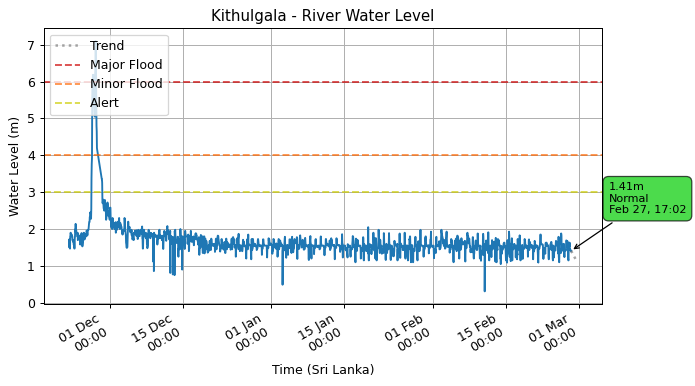

### Glencourse (Kelani Ganga)

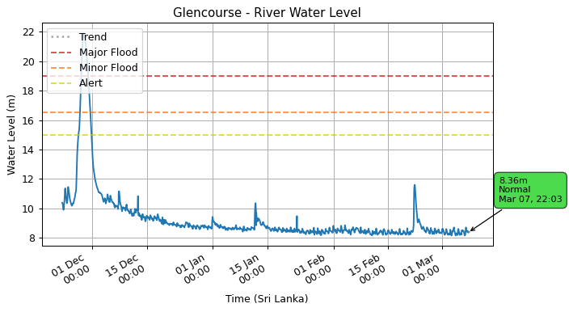

### Wellawaya (Kirindi Oya)

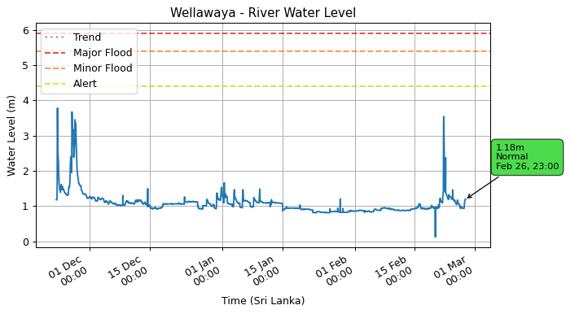

### Kalawellawa (Millakanda) (Kalu Ganga)

.png)

### Putupaula (Kalu Ganga)

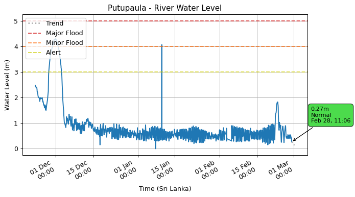

### Thalgahagoda (Nilwala Ganga)

### Thanamalwila (Kirindi Oya)

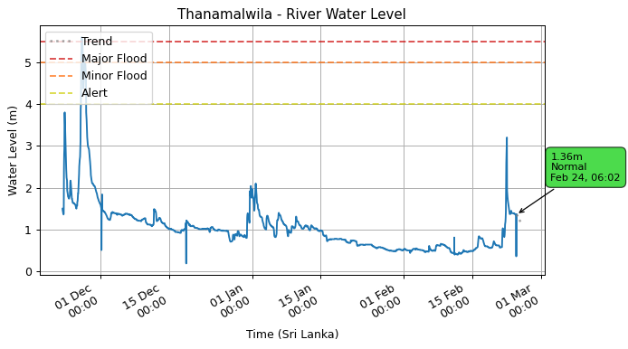

### Urawa (Nilwala Ganga)

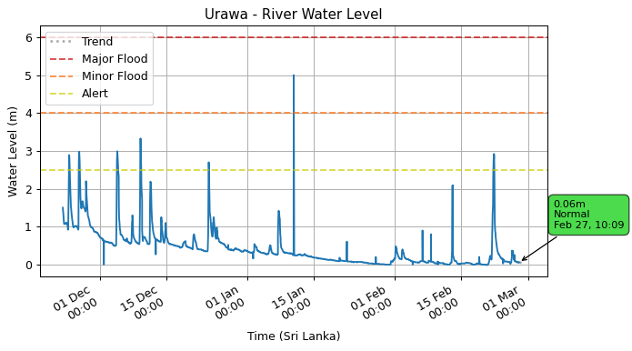

### Nakkala (Kumbukkan Oya)

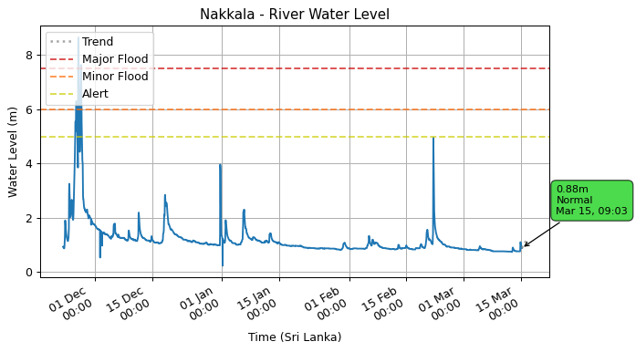

### Moragaswewa (Deduru Oya)

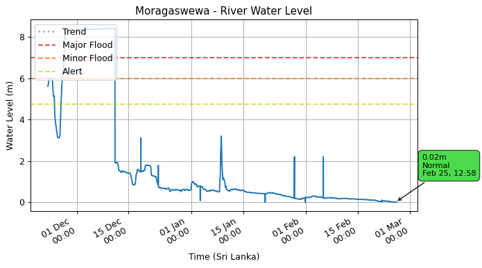

### Yaka Wewa (Ma Oya)

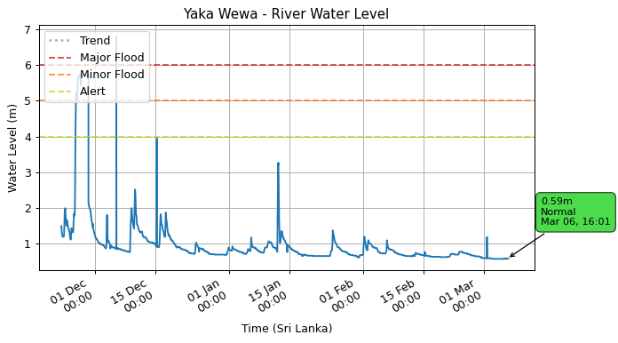

### Giriulla (Maha Oya)

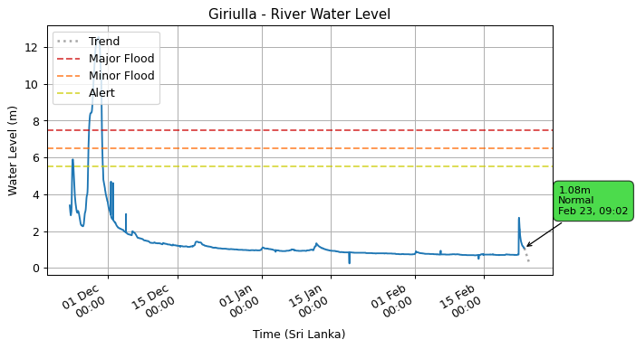

### Horowpothana (Yan Oya)

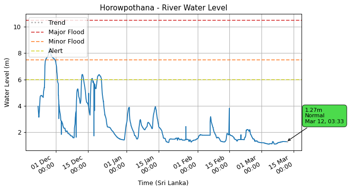

### Galgamuwa (Mee Oya)

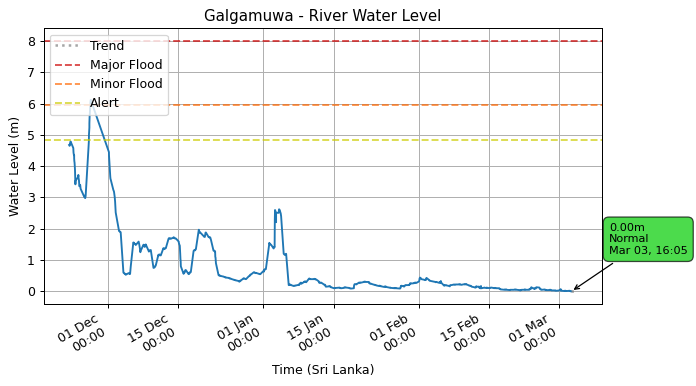

### Pitabeddara (Nilwala Ganga)

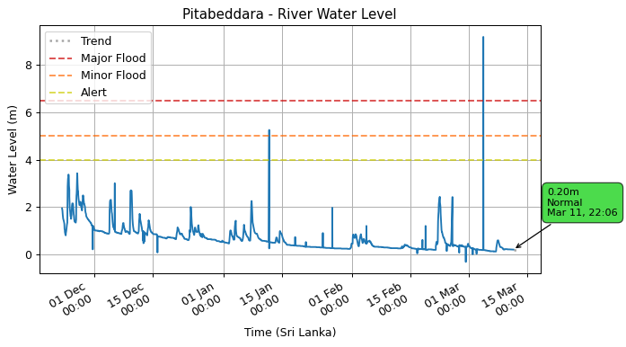

### Hanwella (Kelani Ganga)

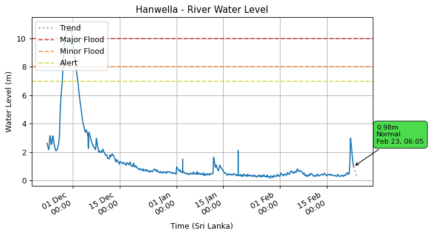

### Panadugama (Nilwala Ganga)

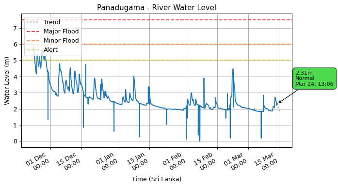

### Nagalagam Street (Kelani Ganga)

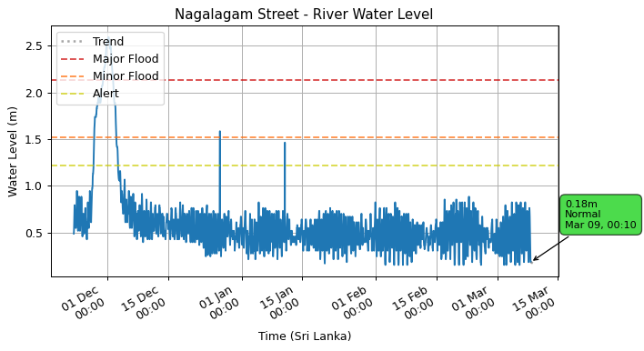

### Moraketiya (Walawe Ganga)

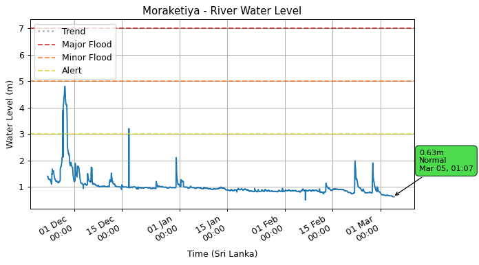

### Siyambalanduwa (Heda Oya)

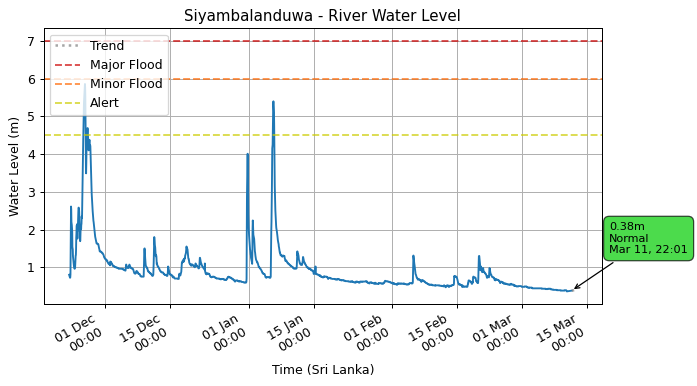

### Dunamale (Aththanagalu Oya)

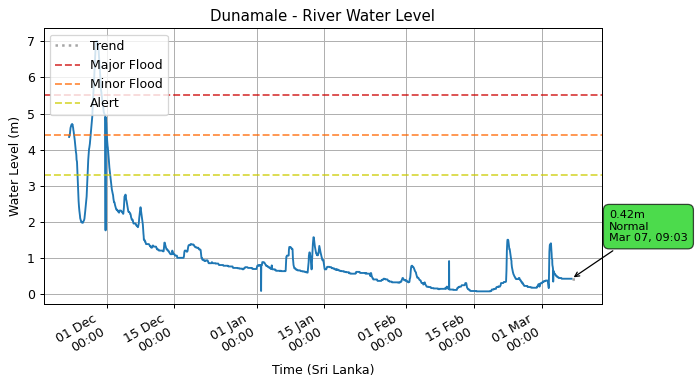

### Thaldena (Mahaweli Ganga)

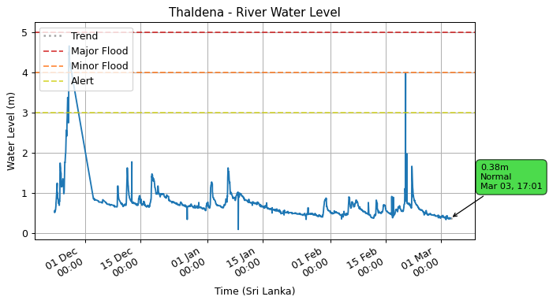

### Katharagama (Menik Ganga)

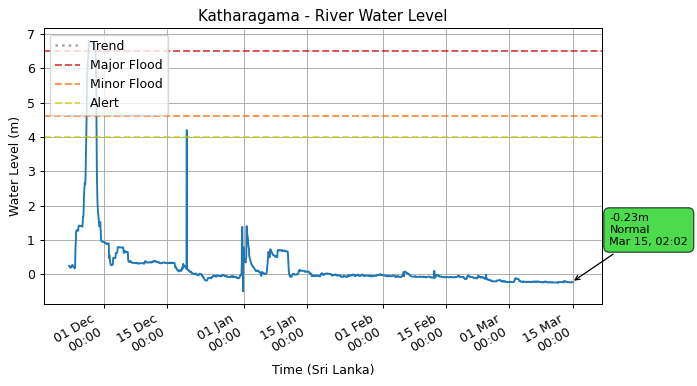

### Badalgama (Maha Oya)

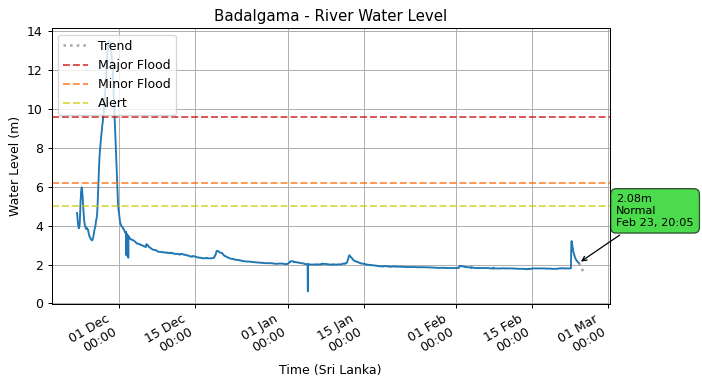

### Manampitiya (Mahaweli Ganga)

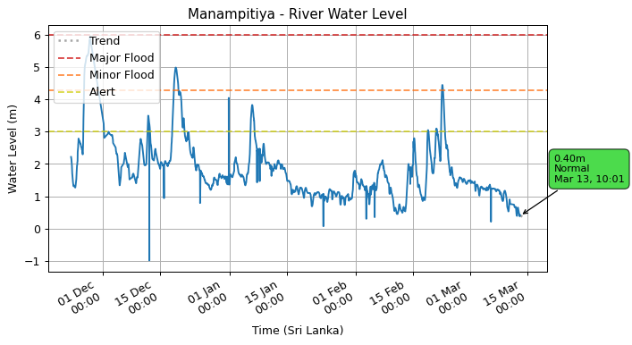

### Thanthirimale (Malwathu Oya)

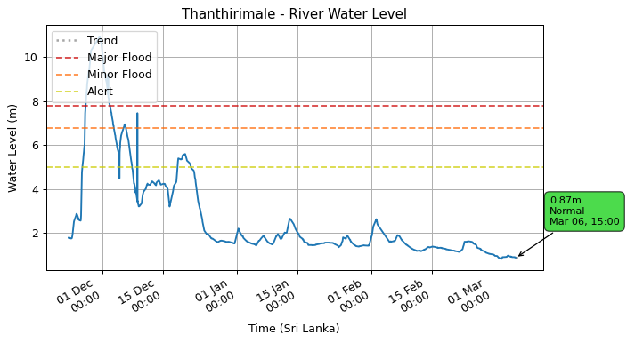

### Kuda Oya (Kirindi Oya)

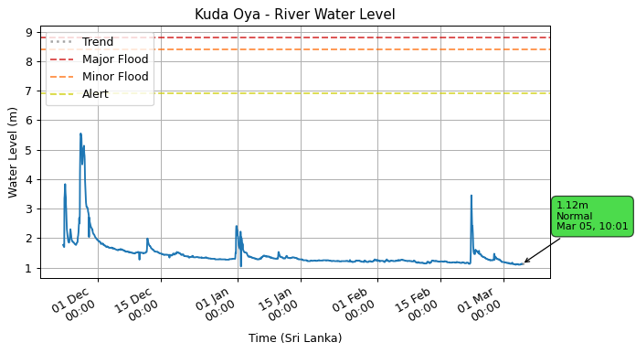

### Ellagawa (Kalu Ganga)

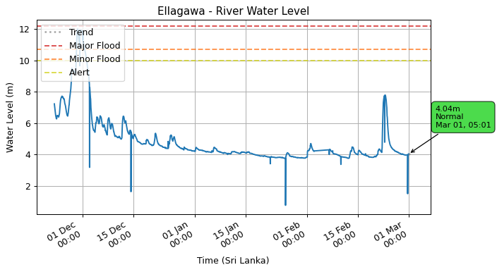

### Norwood (Kelani Ganga)

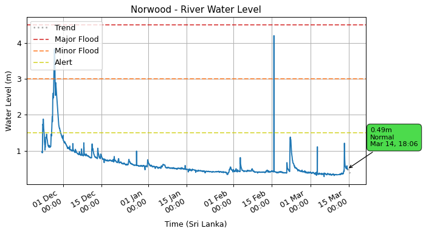

### Magura (Kalu Ganga)

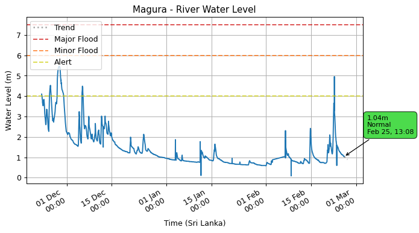

### Holombuwa (Kelani Ganga)

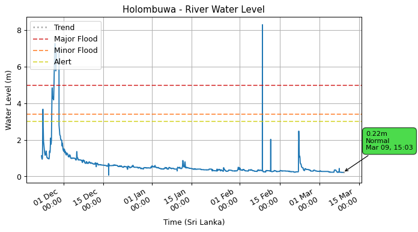

### Thawalama (Gin Ganga)

### Padiyathalawa (Maduru Oya)

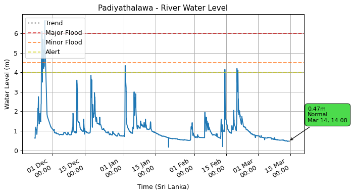

### Deraniyagala (Kelani Ganga)

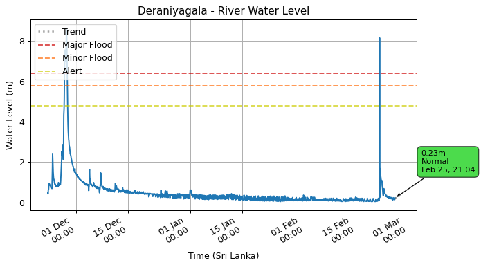

### Rathnapura (Kalu Ganga)

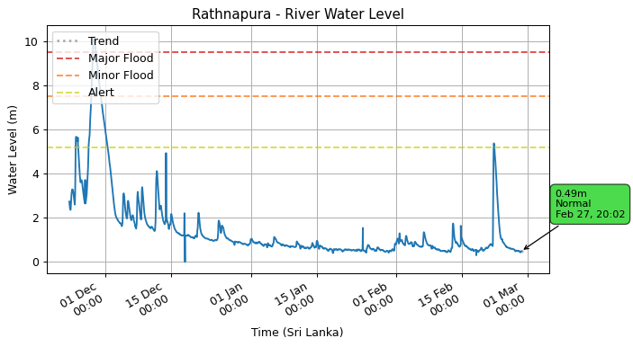

### Baddegama (Gin Ganga)

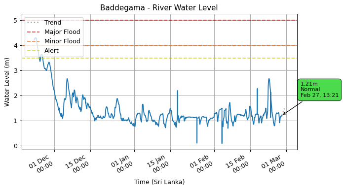

### Peradeniya (Mahaweli Ganga)

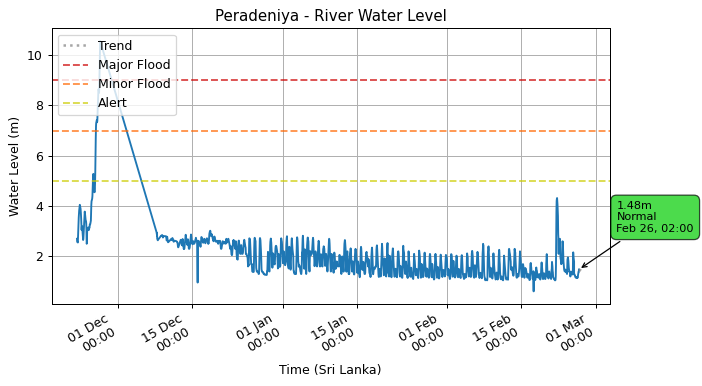

### Weraganthota (Mahaweli Ganga)

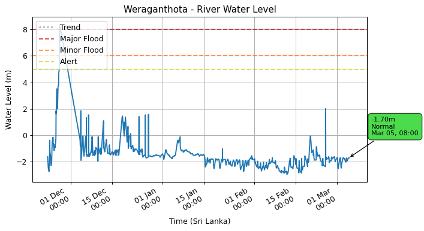

### Nawalapitiya (Mahaweli Ganga)

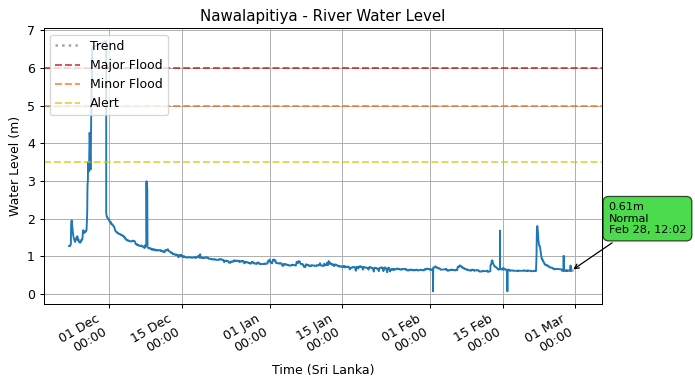

