# lk_irrigation 🇱🇰

Realtime Data about *River Water Levels* in Sri Lanka, from the [Irrigation Deptartment](https://www.irrigation.gov.lk)'s [Hydrology and Disaster Management](https://www.irrigation.gov.lk/web/index.php?option=com_content&view=article&id=27&Itemid=128&lang=en) Division.

- [Complete Dataset](data/rwlds) with **87,459 measurements** from **39** stations.
- [Scrape and load logic](src/lk_irrigation/rwld/RiverWaterLevelDataLoadMixin.py)
- [Original Data source](https://www.arcgis.com/apps/dashboards/2cffe83c9ff5497d97375498bdf3ff38)

## River Water Level Map

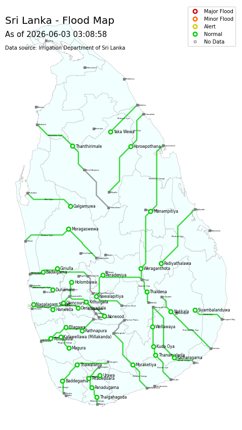

## Latest measurements

*There were **40** measurements in the last **1 hour**.*

| Measured At | Station (River Basin) | Level (m) | Alert Level | Rate-of-Rise (m/hr) | Rising Alert |
| --- | --- | ---: | --- | ---: | --- |
| 2026-03-02 20:10:42 | Kalawellawa (Millakanda) (Kalu Ganga) | 1.37 | 🟢 Normal | -0.009 |  |
| 2026-03-02 20:10:33 | Yaka Wewa (Ma Oya) | 0.59 | 🟢 Normal | 0.000 |  |
| 2026-03-02 20:10:32 | Magura (Kalu Ganga) | 0.73 | 🟢 Normal | -36.000 |  |
| 2026-03-02 20:10:31 | Magura (Kalu Ganga) | 0.74 | 🟢 Normal | -36.000 |  |
| 2026-03-02 20:10:16 | Magura (Kalu Ganga) | 0.74 | 🟢 Normal | -36.000 |  |
| 2026-03-02 20:09:13 | Putupaula (Kalu Ganga) | 0.35 | 🟢 Normal | -0.139 |  |
| 2026-03-02 20:08:12 | Urawa (Nilwala Ganga) | 0.01 | 🟢 Normal | 0.000 |  |
| 2026-03-02 20:07:43 | Baddegama (Gin Ganga) | 1.21 | 🟢 Normal | 0.000 |  |
| 2026-03-02 20:07:36 | Peradeniya (Mahaweli Ganga) | 1.15 | 🟢 Normal | 0.067 | 🔺 Rising |
| 2026-03-02 20:06:41 | Badalgama (Maha Oya) | 1.76 | 🟢 Normal | 0.000 |  |
| 2026-03-02 20:06:31 | Norwood (Kelani Ganga) | 0.35 | 🟢 Normal | 0.000 |  |
| 2026-03-02 20:06:28 | Holombuwa (Kelani Ganga) | 0.27 | 🟢 Normal | 0.000 |  |
| 2026-03-02 20:05:53 | Giriulla (Maha Oya) | 0.70 | 🟢 Normal | 0.000 |  |
| 2026-03-02 20:05:01 | Moraketiya (Walawe Ganga) | 0.67 | 🟢 Normal | 0.000 |  |
| 2026-03-02 20:04:57 | Rathnapura (Kalu Ganga) | 0.53 | 🟢 Normal | 0.074 | 🔺 Rising |
| 2026-03-02 20:04:42 | Katharagama (Menik Ganga) | -0.13 | 🟢 Normal | 0.000 |  |
| 2026-03-02 20:04:41 | Nagalagam Street (Kelani Ganga) | 0.15 | 🟢 Normal | -0.032 |  |
| 2026-03-02 20:04:40 | Horowpothana (Yan Oya) | 1.14 | 🟢 Normal | -0.017 |  |
| 2026-03-02 20:04:12 | Wellawaya (Kirindi Oya) | 0.74 | 🟢 Normal | -0.009 |  |
| 2026-03-02 20:04:10 | Thawalama (Gin Ganga) | 1.12 | 🟢 Normal | 0.030 | 🔺 Rising |
| 2026-03-02 20:04:01 | Glencourse (Kelani Ganga) | 8.26 | 🟢 Normal | 0.000 |  |
| 2026-03-02 20:03:54 | Kuda Oya (Kirindi Oya) | 1.13 | 🟢 Normal | 0.000 |  |
| 2026-03-02 20:03:43 | Pitabeddara (Nilwala Ganga) | 0.21 | 🟢 Normal | 0.000 |  |
| 2026-03-02 20:03:37 | Hanwella (Kelani Ganga) | 0.23 | 🟢 Normal | -0.020 |  |
| 2026-03-02 20:03:09 | Manampitiya (Mahaweli Ganga) | 1.36 | 🟢 Normal | 0.000 |  |
| 2026-03-02 20:02:51 | Kithulgala (Kelani Ganga) | 1.78 | 🟢 Normal | 0.000 |  |
| 2026-03-02 20:02:49 | Ellagawa (Kalu Ganga) | 3.89 | 🟢 Normal | -0.010 |  |
| 2026-03-02 20:02:38 | Deraniyagala (Kelani Ganga) | 0.11 | 🟢 Normal | 0.000 |  |
| 2026-03-02 20:02:33 | Padiyathalawa (Maduru Oya) | 0.67 | 🟢 Normal | 0.000 |  |
| 2026-03-02 20:02:08 | Dunamale (Aththanagalu Oya) | 1.26 | 🟢 Normal | 0.091 | 🔺 Rising |
| 2026-03-02 20:01:53 | Siyambalanduwa (Heda Oya) | 0.46 | 🟢 Normal | 0.000 |  |
| 2026-03-02 20:01:40 | Nakkala (Kumbukkan Oya) | 0.82 | 🟢 Normal | 0.000 |  |
| 2026-03-02 20:01:33 | Thaldena (Mahaweli Ganga) | 0.42 | 🟢 Normal | -0.020 |  |
| 2026-03-02 20:01:19 | Thalgahagoda (Nilwala Ganga) | 0.29 | 🟢 Normal | -0.061 |  |
| 2026-03-02 20:01:13 | Thanamalwila (Kirindi Oya) | 0.42 | 🟢 Normal | -0.011 |  |
| 2026-03-02 20:01:02 | Nawalapitiya (Mahaweli Ganga) | 0.59 | 🟢 Normal | 0.000 |  |
| 2026-03-02 20:00:57 | Moragaswewa (Deduru Oya) | 0.01 | 🟢 Normal | 0.000 |  |
| 2026-03-02 19:49:25 | Panadugama (Nilwala Ganga) | 1.96 | 🟢 Normal | 0.000 |  |
| 2026-03-02 19:42:20 | Panadugama (Nilwala Ganga) | 1.96 | 🟢 Normal | 0.000 |  |
| 2026-03-02 19:29:47 | Horowpothana (Yan Oya) | 1.15 | 🟢 Normal | -0.017 |  |

## Latest by Station

*⌛ = Latest measurement is older than **24 hours**.*

| Measured At | Station (River Basin) | Level (m) | Alert Level | Rate-of-Rise (m/hr) | Rising Alert |
| --- | --- | ---: | --- | ---: | --- |
| 2026-03-02 18:07:20 | Weraganthota (Mahaweli Ganga) | -2.30 | 🟢 Normal | 0.162 | 🔺 Rising |
| 2026-03-02 20:02:08 | Dunamale (Aththanagalu Oya) | 1.26 | 🟢 Normal | 0.091 | 🔺 Rising |
| 2026-03-02 20:04:57 | Rathnapura (Kalu Ganga) | 0.53 | 🟢 Normal | 0.074 | 🔺 Rising |
| 2026-03-02 20:07:36 | Peradeniya (Mahaweli Ganga) | 1.15 | 🟢 Normal | 0.067 | 🔺 Rising |
| 2026-03-02 20:04:10 | Thawalama (Gin Ganga) | 1.12 | 🟢 Normal | 0.030 | 🔺 Rising |
| 2026-03-02 20:02:51 | Kithulgala (Kelani Ganga) | 1.78 | 🟢 Normal | 0.000 |  |
| 2026-03-02 20:01:40 | Nakkala (Kumbukkan Oya) | 0.82 | 🟢 Normal | 0.000 |  |
| 2026-03-02 20:00:57 | Moragaswewa (Deduru Oya) | 0.01 | 🟢 Normal | 0.000 |  |
| 2026-03-02 20:01:02 | Nawalapitiya (Mahaweli Ganga) | 0.59 | 🟢 Normal | 0.000 |  |
| 2026-03-02 20:10:33 | Yaka Wewa (Ma Oya) | 0.59 | 🟢 Normal | 0.000 |  |
| 2026-03-02 20:05:53 | Giriulla (Maha Oya) | 0.70 | 🟢 Normal | 0.000 |  |
| 2026-03-02 18:00:46 | Galgamuwa (Mee Oya) | 0.01 | 🟢 Normal | 0.000 |  |
| 2026-03-02 20:03:43 | Pitabeddara (Nilwala Ganga) | 0.21 | 🟢 Normal | 0.000 |  |
| 2026-03-02 20:06:31 | Norwood (Kelani Ganga) | 0.35 | 🟢 Normal | 0.000 |  |
| 2026-03-02 20:02:38 | Deraniyagala (Kelani Ganga) | 0.11 | 🟢 Normal | 0.000 |  |
| 2026-03-02 20:07:43 | Baddegama (Gin Ganga) | 1.21 | 🟢 Normal | 0.000 |  |
| 2026-03-02 19:49:25 | Panadugama (Nilwala Ganga) | 1.96 | 🟢 Normal | 0.000 |  |
| 2026-03-02 20:02:33 | Padiyathalawa (Maduru Oya) | 0.67 | 🟢 Normal | 0.000 |  |
| 2026-03-02 20:04:01 | Glencourse (Kelani Ganga) | 8.26 | 🟢 Normal | 0.000 |  |
| 2026-03-02 20:05:01 | Moraketiya (Walawe Ganga) | 0.67 | 🟢 Normal | 0.000 |  |
| 2026-03-02 20:01:53 | Siyambalanduwa (Heda Oya) | 0.46 | 🟢 Normal | 0.000 |  |
| 2026-03-02 20:04:42 | Katharagama (Menik Ganga) | -0.13 | 🟢 Normal | 0.000 |  |
| 2026-03-02 20:06:41 | Badalgama (Maha Oya) | 1.76 | 🟢 Normal | 0.000 |  |
| 2026-03-02 20:06:28 | Holombuwa (Kelani Ganga) | 0.27 | 🟢 Normal | 0.000 |  |
| 2026-03-02 20:03:09 | Manampitiya (Mahaweli Ganga) | 1.36 | 🟢 Normal | 0.000 |  |
| 2026-03-02 20:08:12 | Urawa (Nilwala Ganga) | 0.01 | 🟢 Normal | 0.000 |  |
| 2026-03-02 20:03:54 | Kuda Oya (Kirindi Oya) | 1.13 | 🟢 Normal | 0.000 |  |
| 2026-03-02 20:10:42 | Kalawellawa (Millakanda) (Kalu Ganga) | 1.37 | 🟢 Normal | -0.009 |  |
| 2026-03-02 20:04:12 | Wellawaya (Kirindi Oya) | 0.74 | 🟢 Normal | -0.009 |  |
| 2026-03-02 18:03:36 | Thanthirimale (Malwathu Oya) | 0.86 | 🟢 Normal | -0.010 |  |
| 2026-03-02 20:02:49 | Ellagawa (Kalu Ganga) | 3.89 | 🟢 Normal | -0.010 |  |
| 2026-03-02 20:01:13 | Thanamalwila (Kirindi Oya) | 0.42 | 🟢 Normal | -0.011 |  |
| 2026-03-02 20:04:40 | Horowpothana (Yan Oya) | 1.14 | 🟢 Normal | -0.017 |  |
| 2026-03-02 20:01:33 | Thaldena (Mahaweli Ganga) | 0.42 | 🟢 Normal | -0.020 |  |
| 2026-03-02 20:03:37 | Hanwella (Kelani Ganga) | 0.23 | 🟢 Normal | -0.020 |  |
| 2026-03-02 20:04:41 | Nagalagam Street (Kelani Ganga) | 0.15 | 🟢 Normal | -0.032 |  |
| 2026-03-02 20:01:19 | Thalgahagoda (Nilwala Ganga) | 0.29 | 🟢 Normal | -0.061 |  |
| 2026-03-02 20:09:13 | Putupaula (Kalu Ganga) | 0.35 | 🟢 Normal | -0.139 |  |
| 2026-03-02 20:10:32 | Magura (Kalu Ganga) | 0.73 | 🟢 Normal | -36.000 |  |

## River Water Level Charts by Station

### Weraganthota (Mahaweli Ganga)

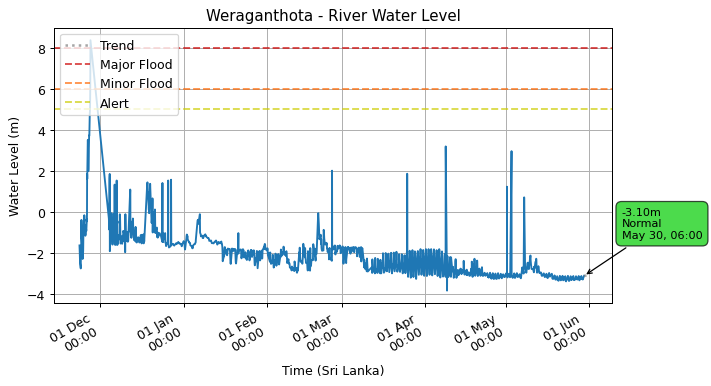

### Dunamale (Aththanagalu Oya)

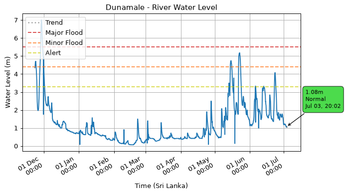

### Rathnapura (Kalu Ganga)

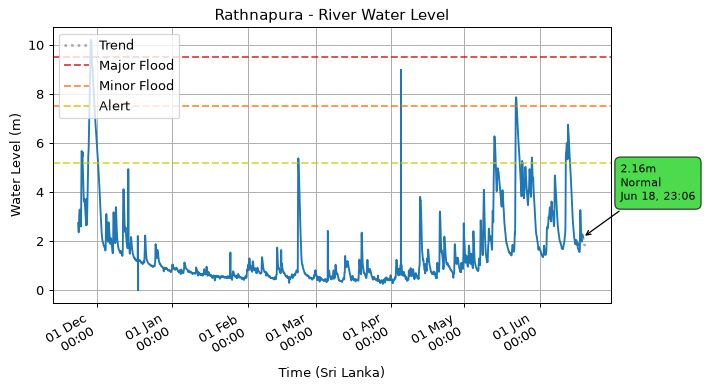

### Peradeniya (Mahaweli Ganga)

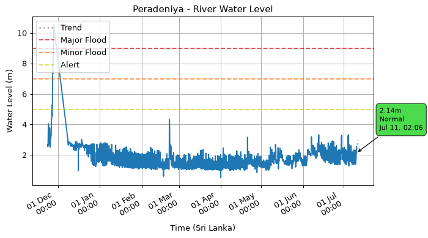

### Thawalama (Gin Ganga)

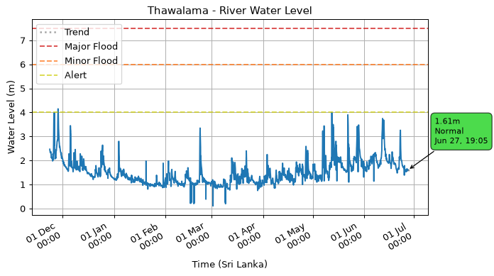

### Kithulgala (Kelani Ganga)

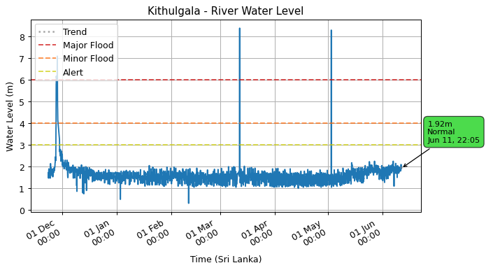

### Nakkala (Kumbukkan Oya)

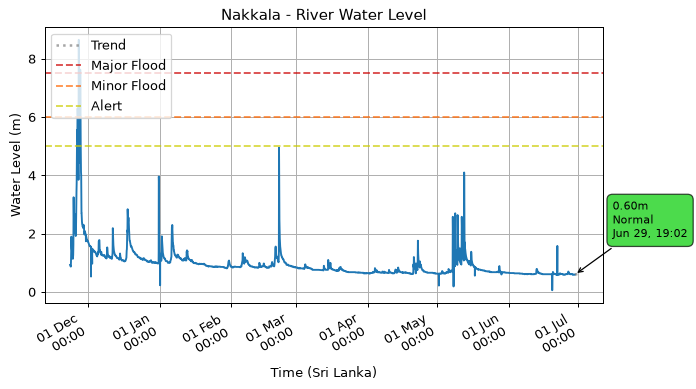

### Moragaswewa (Deduru Oya)

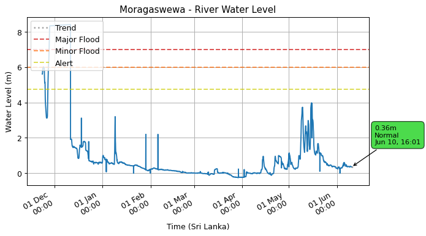

### Nawalapitiya (Mahaweli Ganga)

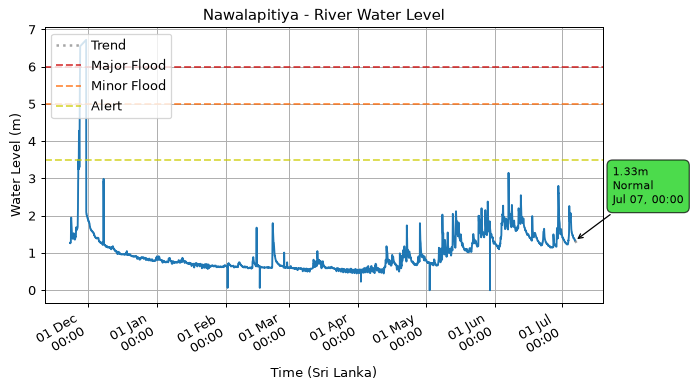

### Yaka Wewa (Ma Oya)

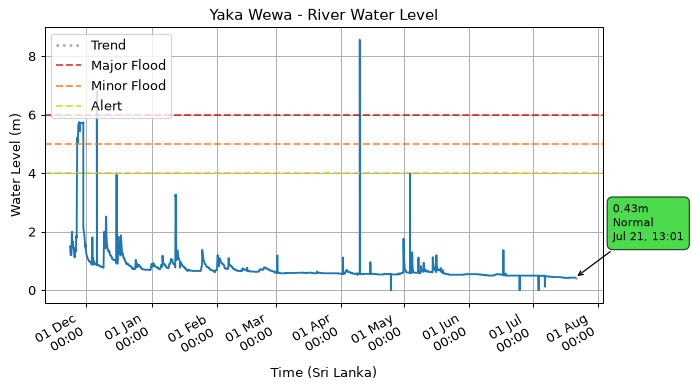

### Giriulla (Maha Oya)

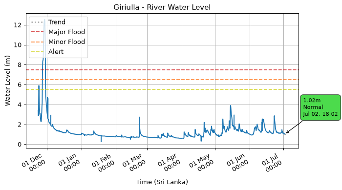

### Galgamuwa (Mee Oya)

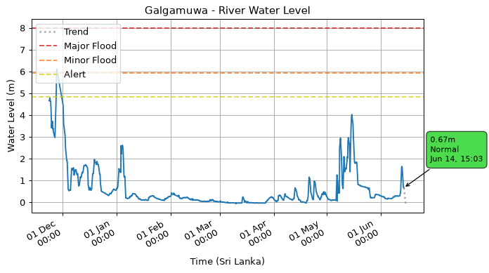

### Pitabeddara (Nilwala Ganga)

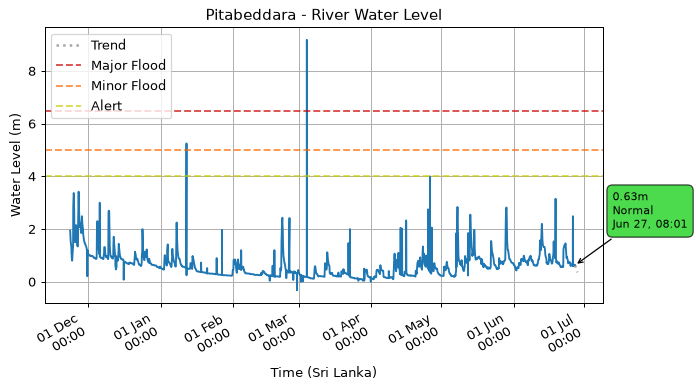

### Norwood (Kelani Ganga)

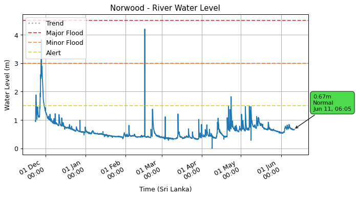

### Deraniyagala (Kelani Ganga)

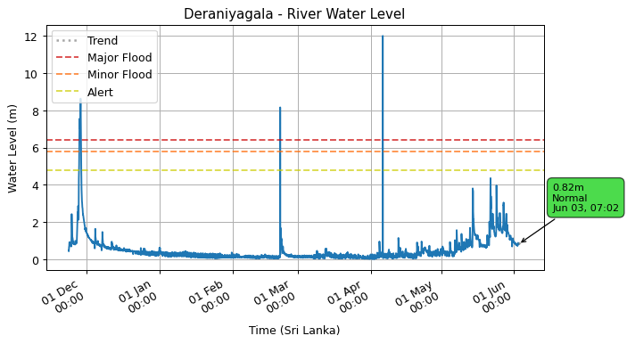

### Baddegama (Gin Ganga)

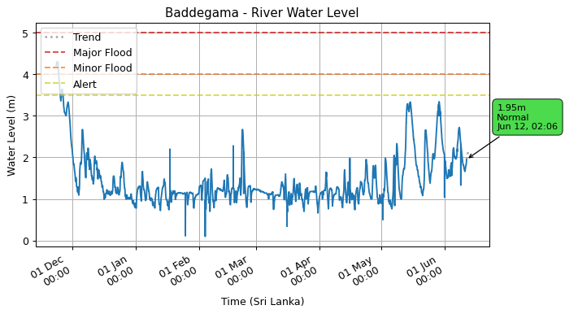

### Panadugama (Nilwala Ganga)

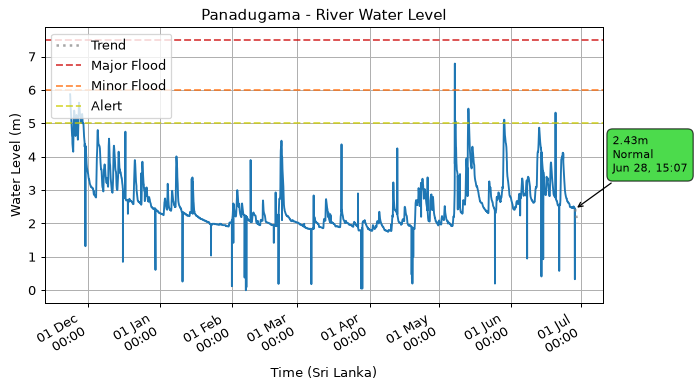

### Padiyathalawa (Maduru Oya)

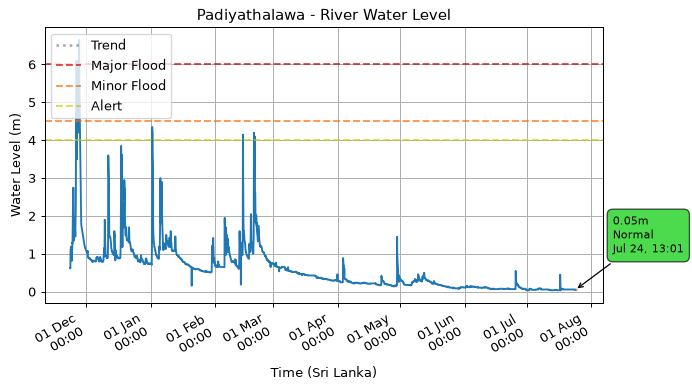

### Glencourse (Kelani Ganga)

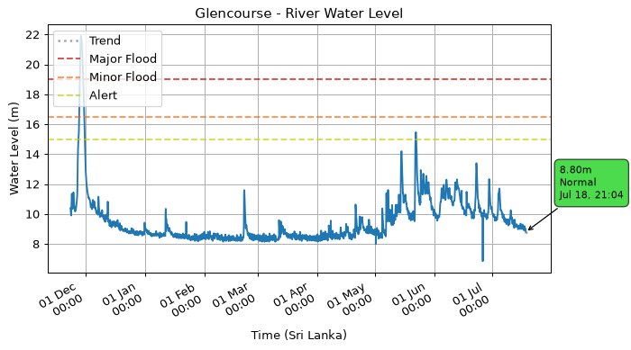

### Moraketiya (Walawe Ganga)

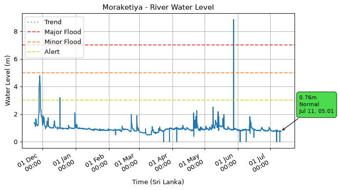

### Siyambalanduwa (Heda Oya)

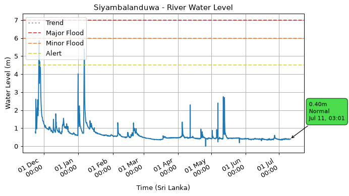

### Katharagama (Menik Ganga)

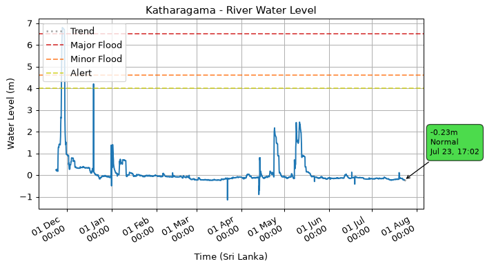

### Badalgama (Maha Oya)

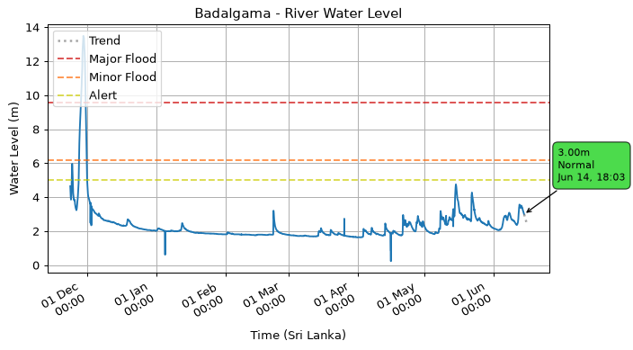

### Holombuwa (Kelani Ganga)

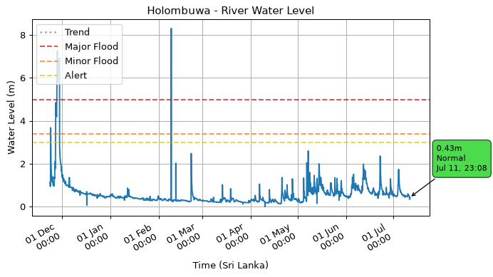

### Manampitiya (Mahaweli Ganga)

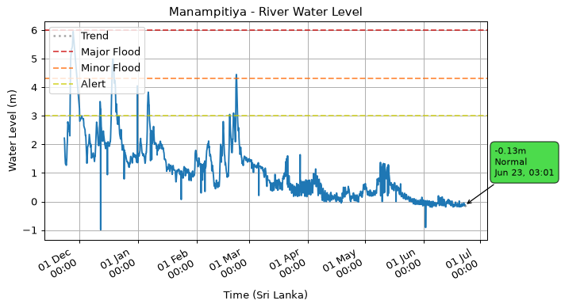

### Urawa (Nilwala Ganga)

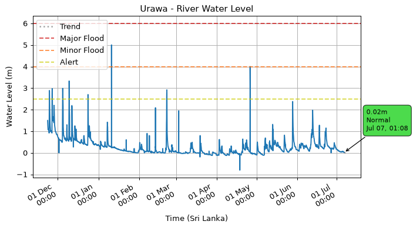

### Kuda Oya (Kirindi Oya)

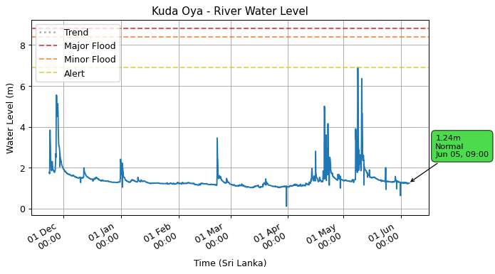

### Kalawellawa (Millakanda) (Kalu Ganga)

.png)

### Wellawaya (Kirindi Oya)

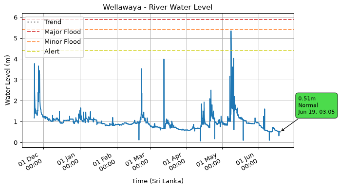

### Thanthirimale (Malwathu Oya)

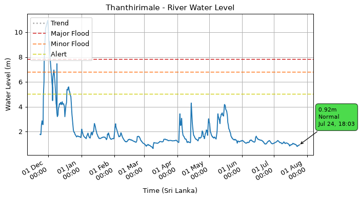

### Ellagawa (Kalu Ganga)

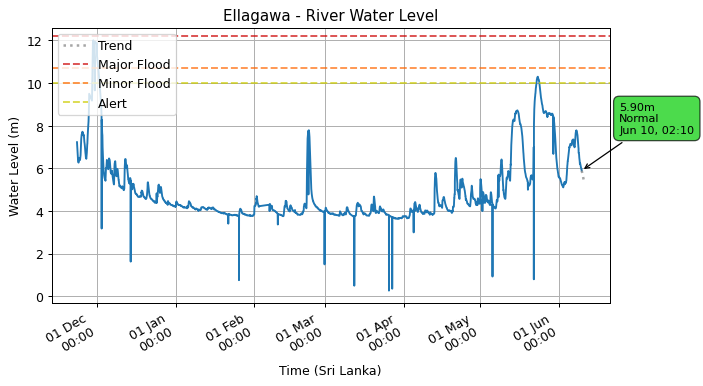

### Thanamalwila (Kirindi Oya)

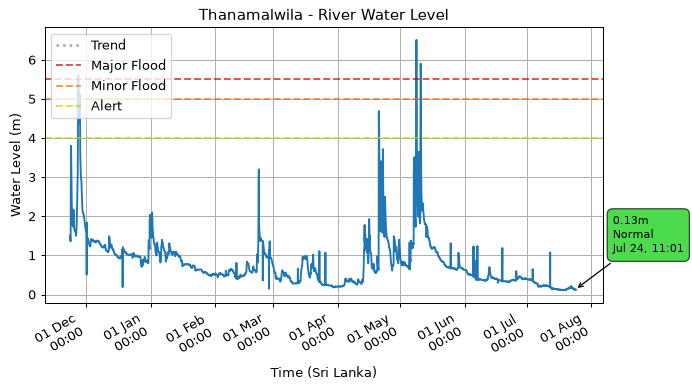

### Horowpothana (Yan Oya)

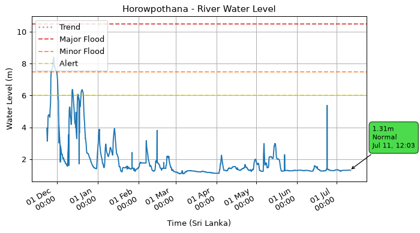

### Thaldena (Mahaweli Ganga)

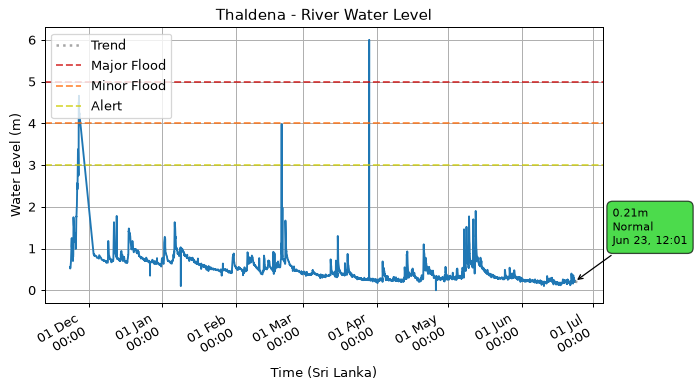

### Hanwella (Kelani Ganga)

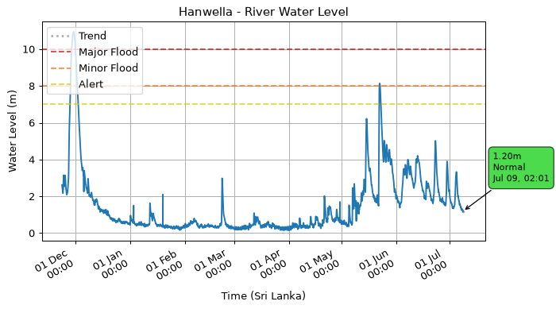

### Nagalagam Street (Kelani Ganga)

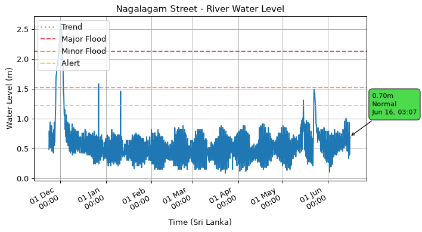

### Thalgahagoda (Nilwala Ganga)

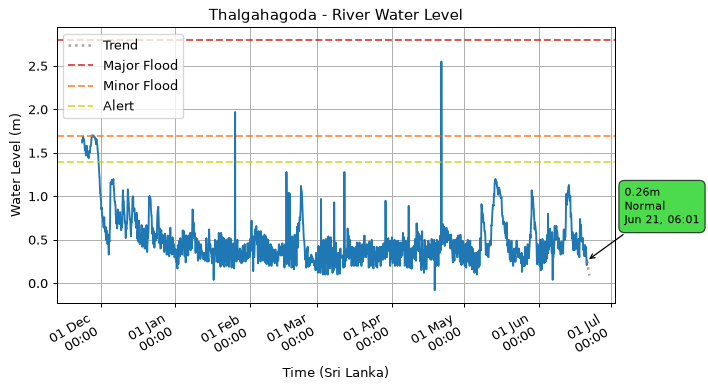

### Putupaula (Kalu Ganga)

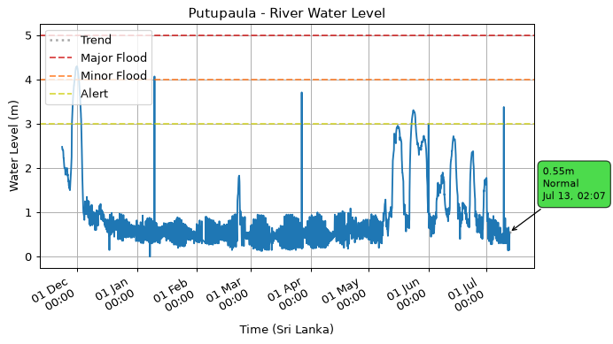

### Magura (Kalu Ganga)

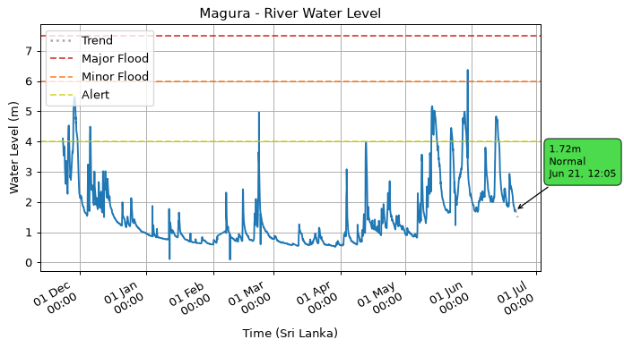

