# lk_irrigation 🇱🇰

Realtime Data about *River Water Levels* in Sri Lanka, from the [Irrigation Deptartment](https://www.irrigation.gov.lk)'s [Hydrology and Disaster Management](https://www.irrigation.gov.lk/web/index.php?option=com_content&view=article&id=27&Itemid=128&lang=en) Division.

- [Complete Dataset](data/rwlds) with **280,370 measurements** from **39** stations.
- [Scrape and load logic](src/lk_irrigation/rwld/RiverWaterLevelDataLoadMixin.py)
- [Original Data source](https://www.arcgis.com/apps/dashboards/2cffe83c9ff5497d97375498bdf3ff38)

🇱🇰 River water alerts: No active alerts.
Source: Sri Lanka Irrigation Department https://www.irrigation.gov.lk
Repo: https://github.com/nuuuwan/lk_irrigation
## River Water Level Map

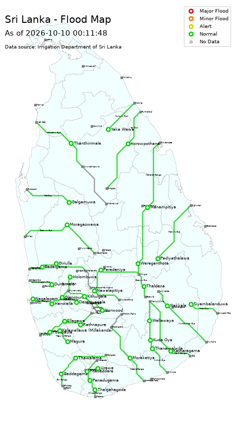

## Latest measurements

*There were **38** measurements in the last **1 hour**.*

| Measured At | Station (River Basin) | Level (m) | Alert Level | Rate-of-Rise (m/hr) | Rising Alert |
| --- | --- | ---: | --- | ---: | --- |
| 2026-10-06 10:07:15 | Magura (Kalu Ganga) | 2.48 | 🟢 Normal | -0.115 |  |
| 2026-10-06 10:06:59 | Badalgama (Maha Oya) | 3.06 | 🟢 Normal | -0.050 |  |
| 2026-10-06 10:06:56 | Holombuwa (Kelani Ganga) | 0.95 | 🟢 Normal | -0.010 |  |
| 2026-10-06 10:06:53 | Nagalagam Street (Kelani Ganga) | 0.73 | 🟢 Normal | 0.030 | 🔺 Rising |
| 2026-10-06 10:06:32 | Putupaula (Kalu Ganga) | 0.85 | 🟢 Normal | 0.076 | 🔺 Rising |
| 2026-10-06 10:05:58 | Thawalama (Gin Ganga) | 2.05 | 🟢 Normal | 0.000 |  |
| 2026-10-06 10:05:51 | Nakkala (Kumbukkan Oya) | 0.79 | 🟢 Normal | -0.019 |  |
| 2026-10-06 10:05:33 | Moraketiya (Walawe Ganga) | 1.00 | 🟢 Normal | -0.019 |  |
| 2026-10-06 10:05:32 | Dunamale (Aththanagalu Oya) | 2.48 | 🟢 Normal | -0.043 |  |
| 2026-10-06 10:05:25 | Pitabeddara (Nilwala Ganga) | 1.14 | 🟢 Normal | -0.010 |  |
| 2026-10-06 10:05:03 | Moragaswewa (Deduru Oya) | 0.03 | 🟢 Normal | 0.000 |  |
| 2026-10-06 10:04:58 | Galgamuwa (Mee Oya) | 0.06 | 🟢 Normal | 0.000 |  |
| 2026-10-06 10:04:56 | Panadugama (Nilwala Ganga) | 3.84 | 🟢 Normal | -0.059 |  |
| 2026-10-06 10:04:29 | Baddegama (Gin Ganga) | 2.10 | 🟢 Normal | 0.000 |  |
| 2026-10-06 10:04:28 | Rathnapura (Kalu Ganga) | 1.64 | 🟢 Normal | -0.050 |  |
| 2026-10-06 10:04:26 | Hanwella (Kelani Ganga) | 3.92 | 🟢 Normal | -0.079 |  |
| 2026-10-06 10:04:24 | Thanamalwila (Kirindi Oya) | 0.39 | 🟢 Normal | 0.000 |  |
| 2026-10-06 10:04:04 | Horowpothana (Yan Oya) | 1.68 | 🟢 Normal | 0.000 |  |
| 2026-10-06 10:03:42 | Urawa (Nilwala Ganga) | 0.48 | 🟢 Normal | 0.000 |  |
| 2026-10-06 10:03:28 | Peradeniya (Mahaweli Ganga) | 2.72 | 🟢 Normal | -0.245 |  |
| 2026-10-06 10:03:22 | Giriulla (Maha Oya) | 1.73 | 🟢 Normal | -0.049 |  |
| 2026-10-06 10:03:20 | Thaldena (Mahaweli Ganga) | 0.23 | 🟢 Normal | -0.039 |  |
| 2026-10-06 10:03:09 | Ellagawa (Kalu Ganga) | 6.10 | 🟢 Normal | -0.020 |  |
| 2026-10-06 10:03:04 | Norwood (Kelani Ganga) | 0.93 | 🟢 Normal | 0.000 |  |
| 2026-10-06 10:02:55 | Katharagama (Menik Ganga) | -0.24 | 🟢 Normal | 0.000 |  |
| 2026-10-06 10:02:35 | Siyambalanduwa (Heda Oya) | 0.29 | 🟢 Normal | -0.010 |  |
| 2026-10-06 10:02:27 | Wellawaya (Kirindi Oya) | 0.95 | 🟢 Normal | 0.020 | 🔺 Rising |
| 2026-10-06 10:02:14 | Kalawellawa (Millakanda) (Kalu Ganga) | 3.91 | 🟢 Normal | -0.010 |  |
| 2026-10-06 10:02:10 | Glencourse (Kelani Ganga) | 11.58 | 🟢 Normal | -0.122 |  |
| 2026-10-06 10:02:09 | Deraniyagala (Kelani Ganga) | 0.93 | 🟢 Normal | 0.000 |  |
| 2026-10-06 10:01:38 | Kithulgala (Kelani Ganga) | 2.10 | 🟢 Normal | 0.051 | 🔺 Rising |
| 2026-10-06 10:01:37 | Yaka Wewa (Ma Oya) | 0.40 | 🟢 Normal | 0.000 |  |
| 2026-10-06 10:01:34 | Thanthirimale (Malwathu Oya) | 0.86 | 🟢 Normal | 0.000 |  |
| 2026-10-06 10:01:34 | Manampitiya (Mahaweli Ganga) | -0.07 | 🟢 Normal | 0.000 |  |
| 2026-10-06 10:01:29 | Kuda Oya (Kirindi Oya) | 1.08 | 🟢 Normal | 0.000 |  |
| 2026-10-06 10:01:06 | Padiyathalawa (Maduru Oya) | 0.10 | 🟢 Normal | -0.011 |  |
| 2026-10-06 10:00:15 | Weraganthota (Mahaweli Ganga) | -2.89 | 🟢 Normal | 0.411 | 🔺 Rising |
| 2026-10-06 10:00:14 | Nawalapitiya (Mahaweli Ganga) | 1.38 | 🟢 Normal | 0.000 |  |

## Latest by Station

*⌛ = Latest measurement is older than **24 hours**.*

| Measured At | Station (River Basin) | Level (m) | Alert Level | Rate-of-Rise (m/hr) | Rising Alert |
| --- | --- | ---: | --- | ---: | --- |
| 2026-10-06 10:00:15 | Weraganthota (Mahaweli Ganga) | -2.89 | 🟢 Normal | 0.411 | 🔺 Rising |
| 2026-10-06 10:06:32 | Putupaula (Kalu Ganga) | 0.85 | 🟢 Normal | 0.076 | 🔺 Rising |
| 2026-10-06 10:01:38 | Kithulgala (Kelani Ganga) | 2.10 | 🟢 Normal | 0.051 | 🔺 Rising |
| 2026-10-06 10:06:53 | Nagalagam Street (Kelani Ganga) | 0.73 | 🟢 Normal | 0.030 | 🔺 Rising |
| 2026-10-06 10:02:27 | Wellawaya (Kirindi Oya) | 0.95 | 🟢 Normal | 0.020 | 🔺 Rising |
| 2026-10-06 10:05:03 | Moragaswewa (Deduru Oya) | 0.03 | 🟢 Normal | 0.000 |  |
| 2026-10-06 10:00:14 | Nawalapitiya (Mahaweli Ganga) | 1.38 | 🟢 Normal | 0.000 |  |
| 2026-10-06 10:01:37 | Yaka Wewa (Ma Oya) | 0.40 | 🟢 Normal | 0.000 |  |
| 2026-10-06 10:04:04 | Horowpothana (Yan Oya) | 1.68 | 🟢 Normal | 0.000 |  |
| 2026-10-06 10:04:58 | Galgamuwa (Mee Oya) | 0.06 | 🟢 Normal | 0.000 |  |
| 2026-10-06 10:03:04 | Norwood (Kelani Ganga) | 0.93 | 🟢 Normal | 0.000 |  |
| 2026-10-06 10:02:09 | Deraniyagala (Kelani Ganga) | 0.93 | 🟢 Normal | 0.000 |  |
| 2026-10-06 10:04:29 | Baddegama (Gin Ganga) | 2.10 | 🟢 Normal | 0.000 |  |
| 2026-10-06 10:02:55 | Katharagama (Menik Ganga) | -0.24 | 🟢 Normal | 0.000 |  |
| 2026-10-06 10:01:34 | Manampitiya (Mahaweli Ganga) | -0.07 | 🟢 Normal | 0.000 |  |
| 2026-10-06 10:01:34 | Thanthirimale (Malwathu Oya) | 0.86 | 🟢 Normal | 0.000 |  |
| 2026-10-06 10:05:58 | Thawalama (Gin Ganga) | 2.05 | 🟢 Normal | 0.000 |  |
| 2026-10-06 10:03:42 | Urawa (Nilwala Ganga) | 0.48 | 🟢 Normal | 0.000 |  |
| 2026-10-06 10:01:29 | Kuda Oya (Kirindi Oya) | 1.08 | 🟢 Normal | 0.000 |  |
| 2026-10-06 10:04:24 | Thanamalwila (Kirindi Oya) | 0.39 | 🟢 Normal | 0.000 |  |
| 2026-10-06 10:06:56 | Holombuwa (Kelani Ganga) | 0.95 | 🟢 Normal | -0.010 |  |
| 2026-10-06 10:02:35 | Siyambalanduwa (Heda Oya) | 0.29 | 🟢 Normal | -0.010 |  |
| 2026-10-06 10:05:25 | Pitabeddara (Nilwala Ganga) | 1.14 | 🟢 Normal | -0.010 |  |
| 2026-10-06 10:02:14 | Kalawellawa (Millakanda) (Kalu Ganga) | 3.91 | 🟢 Normal | -0.010 |  |
| 2026-10-06 10:01:06 | Padiyathalawa (Maduru Oya) | 0.10 | 🟢 Normal | -0.011 |  |
| 2026-10-06 10:05:33 | Moraketiya (Walawe Ganga) | 1.00 | 🟢 Normal | -0.019 |  |
| 2026-10-06 10:05:51 | Nakkala (Kumbukkan Oya) | 0.79 | 🟢 Normal | -0.019 |  |
| 2026-10-06 09:04:24 | Thalgahagoda (Nilwala Ganga) | 0.70 | 🟢 Normal | -0.020 |  |
| 2026-10-06 10:03:09 | Ellagawa (Kalu Ganga) | 6.10 | 🟢 Normal | -0.020 |  |
| 2026-10-06 10:03:20 | Thaldena (Mahaweli Ganga) | 0.23 | 🟢 Normal | -0.039 |  |
| 2026-10-06 10:05:32 | Dunamale (Aththanagalu Oya) | 2.48 | 🟢 Normal | -0.043 |  |
| 2026-10-06 10:03:22 | Giriulla (Maha Oya) | 1.73 | 🟢 Normal | -0.049 |  |
| 2026-10-06 10:06:59 | Badalgama (Maha Oya) | 3.06 | 🟢 Normal | -0.050 |  |
| 2026-10-06 10:04:28 | Rathnapura (Kalu Ganga) | 1.64 | 🟢 Normal | -0.050 |  |
| 2026-10-06 10:04:56 | Panadugama (Nilwala Ganga) | 3.84 | 🟢 Normal | -0.059 |  |
| 2026-10-06 10:04:26 | Hanwella (Kelani Ganga) | 3.92 | 🟢 Normal | -0.079 |  |
| 2026-10-06 10:07:15 | Magura (Kalu Ganga) | 2.48 | 🟢 Normal | -0.115 |  |
| 2026-10-06 10:02:10 | Glencourse (Kelani Ganga) | 11.58 | 🟢 Normal | -0.122 |  |
| 2026-10-06 10:03:28 | Peradeniya (Mahaweli Ganga) | 2.72 | 🟢 Normal | -0.245 |  |

## River Water Level Charts by Station

### Weraganthota (Mahaweli Ganga)

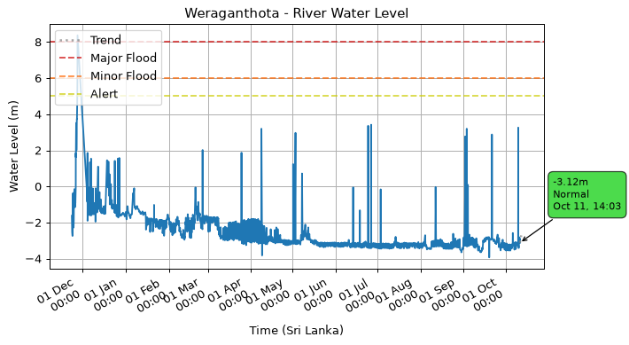

### Putupaula (Kalu Ganga)

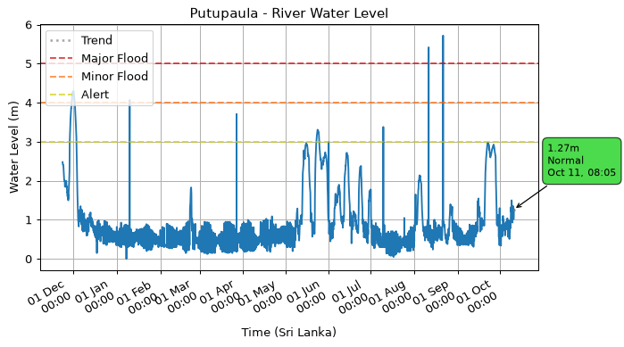

### Kithulgala (Kelani Ganga)

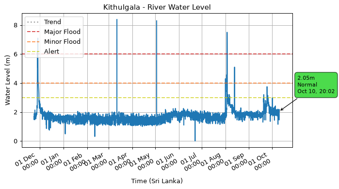

### Nagalagam Street (Kelani Ganga)

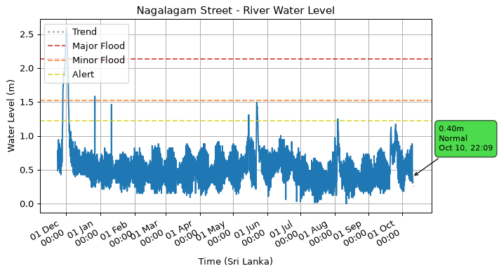

### Wellawaya (Kirindi Oya)

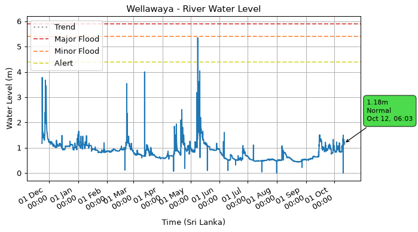

### Moragaswewa (Deduru Oya)

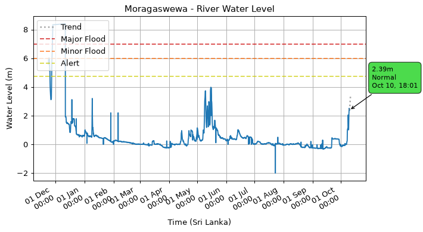

### Nawalapitiya (Mahaweli Ganga)

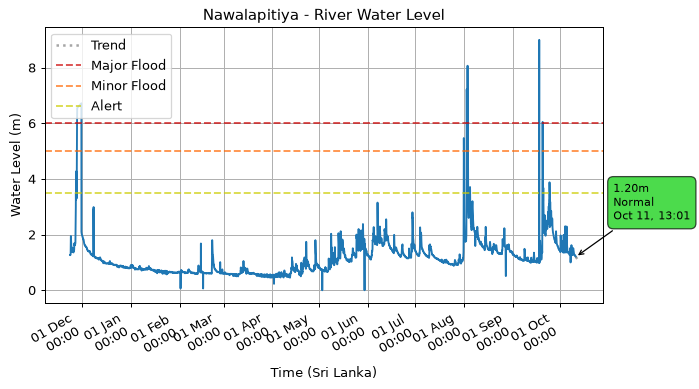

### Yaka Wewa (Ma Oya)

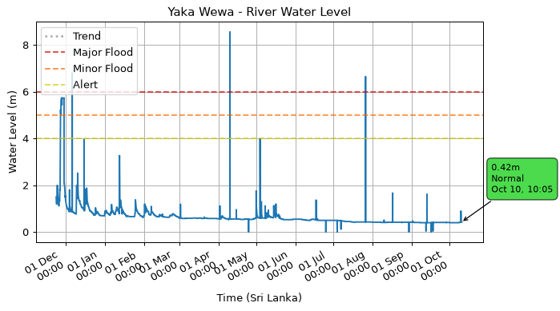

### Horowpothana (Yan Oya)

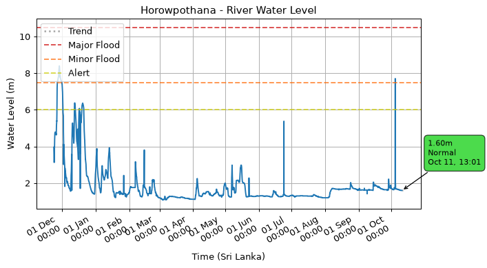

### Galgamuwa (Mee Oya)

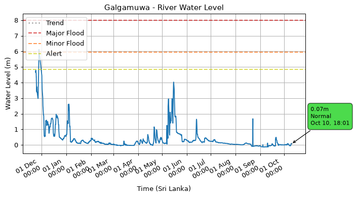

### Norwood (Kelani Ganga)

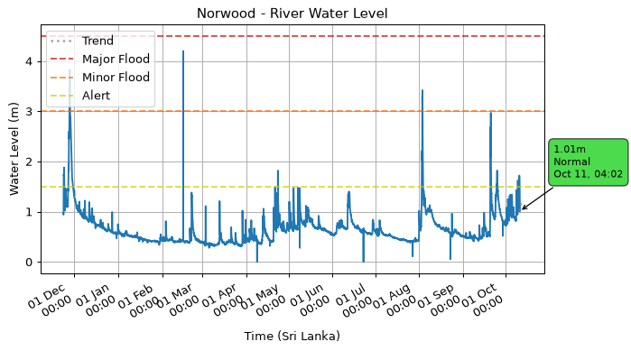

### Deraniyagala (Kelani Ganga)

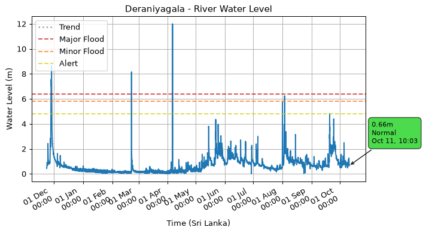

### Baddegama (Gin Ganga)

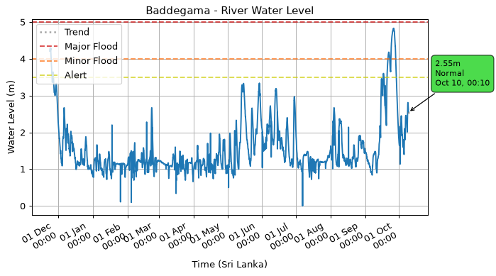

### Katharagama (Menik Ganga)

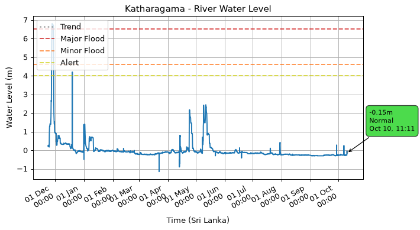

### Manampitiya (Mahaweli Ganga)

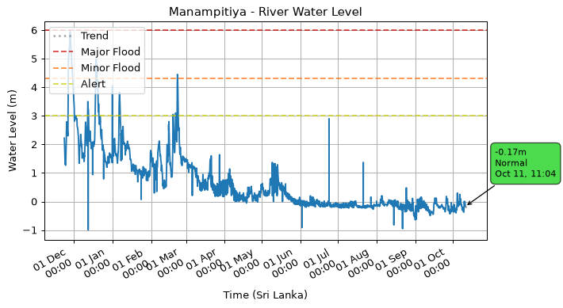

### Thanthirimale (Malwathu Oya)

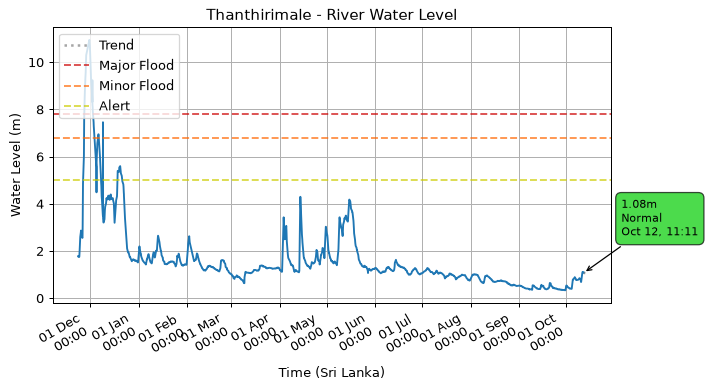

### Thawalama (Gin Ganga)

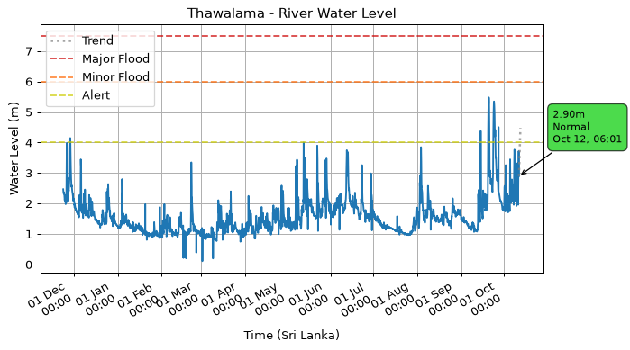

### Urawa (Nilwala Ganga)

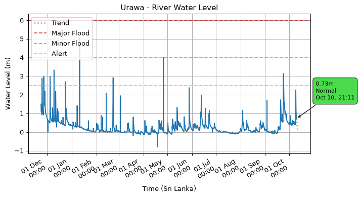

### Kuda Oya (Kirindi Oya)

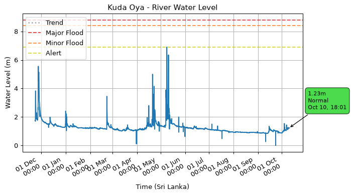

### Thanamalwila (Kirindi Oya)

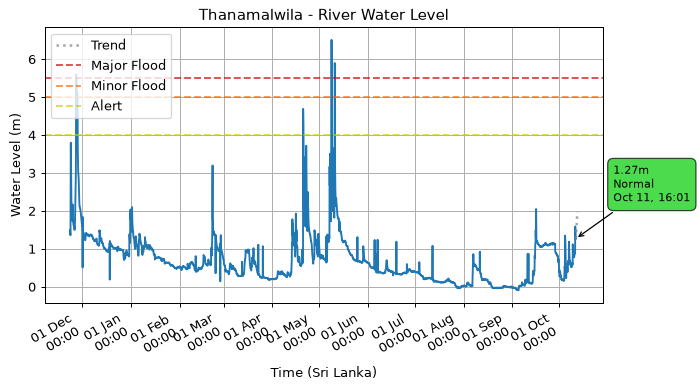

### Holombuwa (Kelani Ganga)

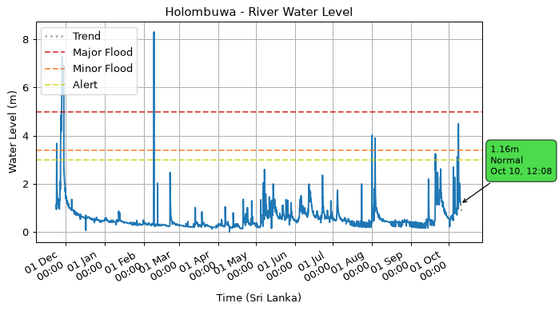

### Siyambalanduwa (Heda Oya)

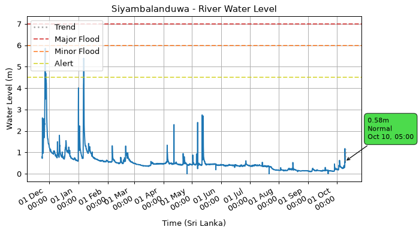

### Pitabeddara (Nilwala Ganga)

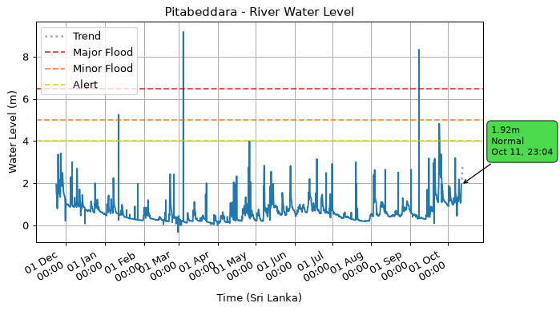

### Kalawellawa (Millakanda) (Kalu Ganga)

.png)

### Padiyathalawa (Maduru Oya)

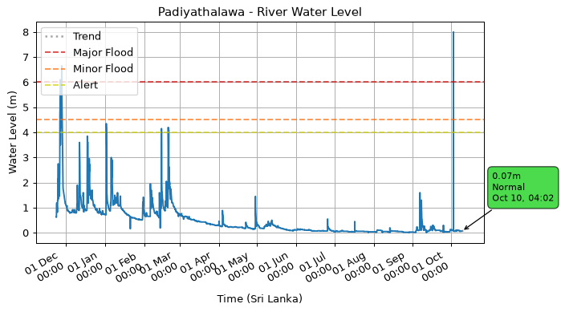

### Moraketiya (Walawe Ganga)

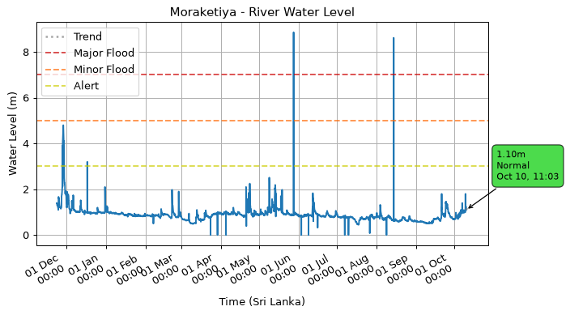

### Nakkala (Kumbukkan Oya)

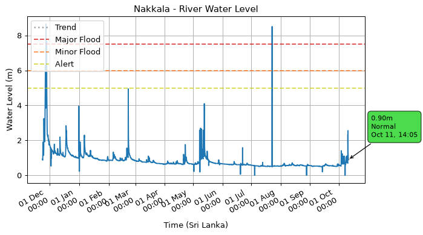

### Thalgahagoda (Nilwala Ganga)

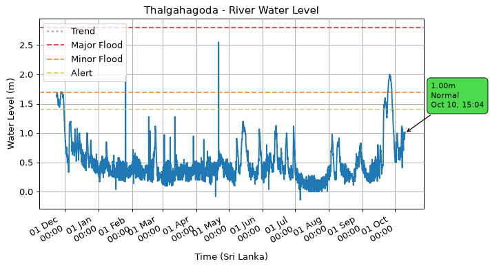

### Ellagawa (Kalu Ganga)

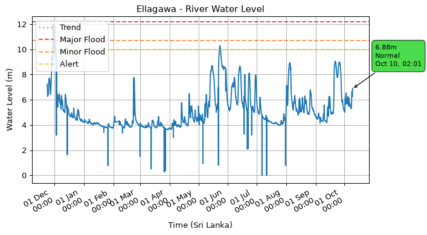

### Thaldena (Mahaweli Ganga)

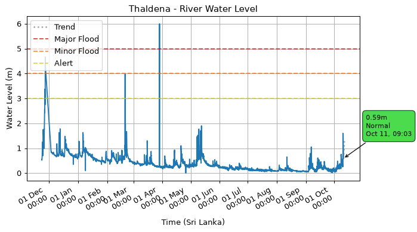

### Dunamale (Aththanagalu Oya)

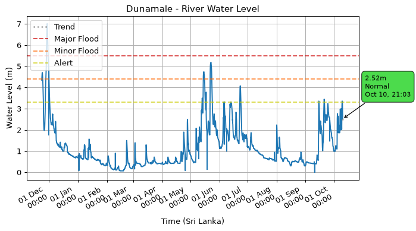

### Giriulla (Maha Oya)

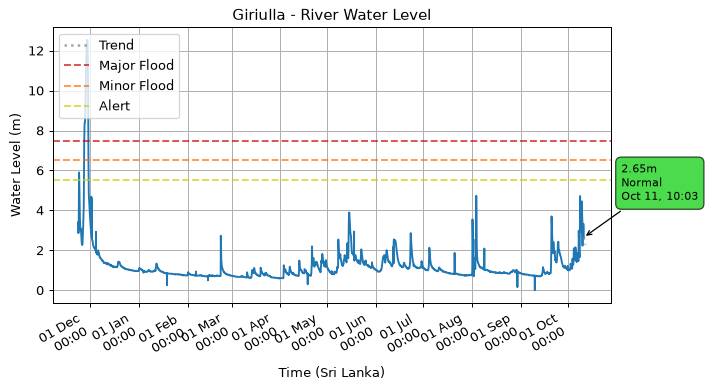

### Badalgama (Maha Oya)

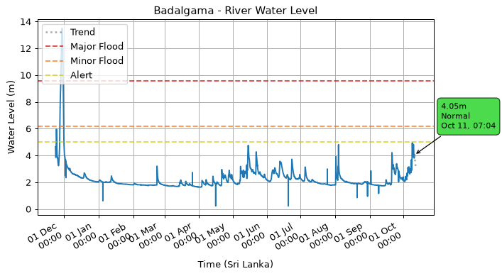

### Rathnapura (Kalu Ganga)

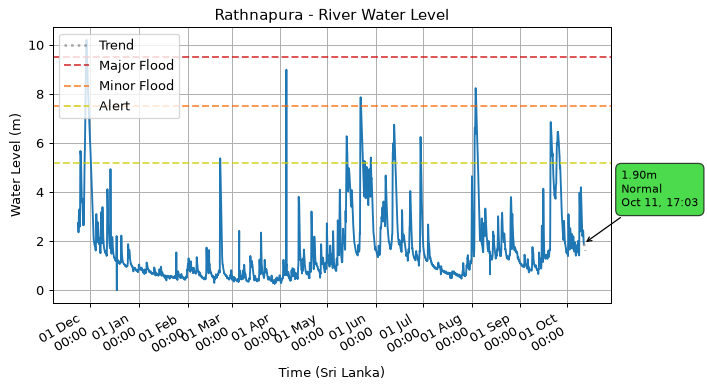

### Panadugama (Nilwala Ganga)

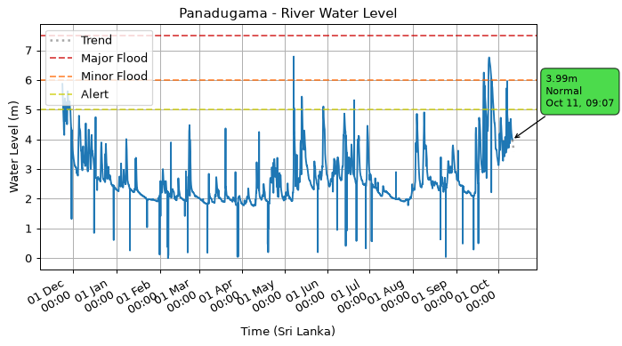

### Hanwella (Kelani Ganga)

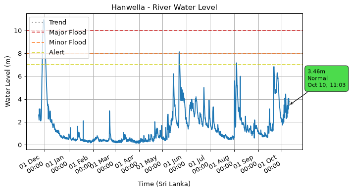

### Magura (Kalu Ganga)

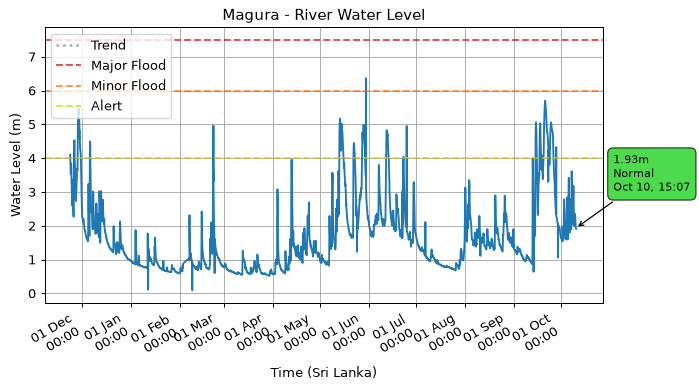

### Glencourse (Kelani Ganga)

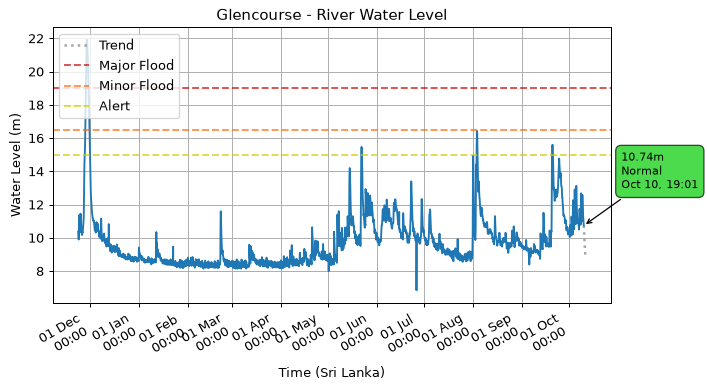

### Peradeniya (Mahaweli Ganga)

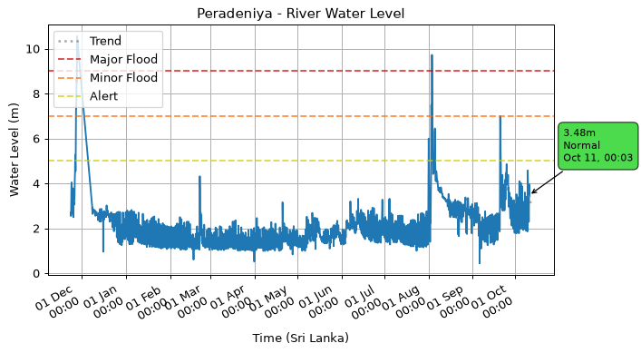

