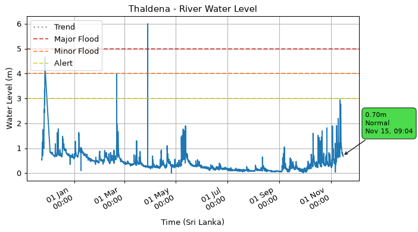
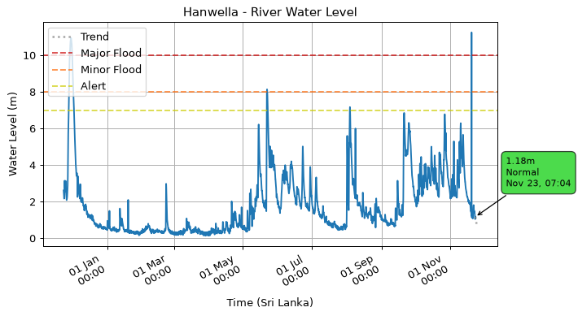

# lk_irrigation 🇱🇰

Realtime Data about *River Water Levels* in Sri Lanka, from the [Irrigation Deptartment](https://www.irrigation.gov.lk)'s [Hydrology and Disaster Management](https://www.irrigation.gov.lk/web/index.php?option=com_content&view=article&id=27&Itemid=128&lang=en) Division.

- [Complete Dataset](data/rwlds) with **326,109 measurements** from **39** stations.
- [Scrape and load logic](src/lk_irrigation/rwld/RiverWaterLevelDataLoadMixin.py)
- [Original Data source](https://www.arcgis.com/apps/dashboards/2cffe83c9ff5497d97375498bdf3ff38)

🇱🇰 River water alerts: 🟡 Kalawellawa (Millakanda) — Alert; 🟡 Dunamale — Alert
Source: Sri Lanka Irrigation Department https://www.irrigation.gov.lk
Repo: https://github.com/nuuuwan/lk_irrigation
## River Water Level Map

## Latest measurements

*There were **16** measurements in the last **1 hour**.*

| Measured At | Station (River Basin) | Level (m) | Alert Level | Rate-of-Rise (m/hr) | Rising Alert |
| --- | --- | ---: | --- | ---: | --- |
| 2026-11-26 11:03:05 | Holombuwa (Kelani Ganga) | 1.22 | 🟢 Normal | -0.035 |  |
| 2026-11-26 11:02:49 | Giriulla (Maha Oya) | 3.08 | 🟢 Normal | -0.100 |  |
| 2026-11-26 11:02:45 | Kalawellawa (Millakanda) (Kalu Ganga) | 5.11 | 🟡 Alert | -0.010 |  |
| 2026-11-26 11:02:33 | Panadugama (Nilwala Ganga) | 3.82 | 🟢 Normal | -0.020 |  |
| 2026-11-26 11:02:27 | Hanwella (Kelani Ganga) | 3.58 | 🟢 Normal | -0.100 |  |
| 2026-11-26 11:01:49 | Nagalagam Street (Kelani Ganga) | 0.55 | 🟢 Normal | 0.062 | 🔺 Rising |
| 2026-11-26 11:01:45 | Horowpothana (Yan Oya) | 2.41 | 🟢 Normal | -0.020 |  |
| 2026-11-26 11:01:45 | Nakkala (Kumbukkan Oya) | 0.89 | 🟢 Normal | 0.000 |  |
| 2026-11-26 11:01:40 | Yaka Wewa (Ma Oya) | 0.51 | 🟢 Normal | 0.000 |  |
| 2026-11-26 11:01:27 | Deraniyagala (Kelani Ganga) | 0.65 | 🟢 Normal | -0.021 |  |
| 2026-11-26 11:01:12 | Glencourse (Kelani Ganga) | 10.97 | 🟢 Normal | -0.157 |  |
| 2026-11-26 11:01:11 | Weraganthota (Mahaweli Ganga) | -1.92 | 🟢 Normal | 0.000 |  |
| 2026-11-26 11:01:08 | Nawalapitiya (Mahaweli Ganga) | 1.32 | 🟢 Normal | -0.011 |  |
| 2026-11-26 11:01:06 | Thaldena (Mahaweli Ganga) | 0.56 | 🟢 Normal | 0.000 |  |
| 2026-11-26 11:00:30 | Kuda Oya (Kirindi Oya) | 1.79 | 🟢 Normal | -0.010 |  |
| 2026-11-26 11:00:16 | Wellawaya (Kirindi Oya) | 1.39 | 🟢 Normal | -0.030 |  |

## Latest by Station

*⌛ = Latest measurement is older than **24 hours**.*

| Measured At | Station (River Basin) | Level (m) | Alert Level | Rate-of-Rise (m/hr) | Rising Alert |
| --- | --- | ---: | --- | ---: | --- |
| 2026-11-26 11:02:45 | Kalawellawa (Millakanda) (Kalu Ganga) | 5.11 | 🟡 Alert | -0.010 |  |
| 2026-11-26 10:03:25 | Dunamale (Aththanagalu Oya) | 3.94 | 🟡 Alert | -0.010 |  |
| 2026-11-26 10:07:20 | Moragaswewa (Deduru Oya) | 4.30 | 🟢 Normal | 0.099 | 🔺 Rising |
| 2026-11-26 10:14:18 | Kithulgala (Kelani Ganga) | 1.39 | 🟢 Normal | 0.098 | 🔺 Rising |
| 2026-11-26 11:01:49 | Nagalagam Street (Kelani Ganga) | 0.55 | 🟢 Normal | 0.062 | 🔺 Rising |
| 2026-11-26 10:01:56 | Thanthirimale (Malwathu Oya) | 1.57 | 🟢 Normal | 0.020 | 🔺 Rising |
| 2026-11-26 11:01:11 | Weraganthota (Mahaweli Ganga) | -1.92 | 🟢 Normal | 0.000 |  |
| 2026-11-26 11:01:45 | Nakkala (Kumbukkan Oya) | 0.89 | 🟢 Normal | 0.000 |  |
| 2026-11-26 11:01:40 | Yaka Wewa (Ma Oya) | 0.51 | 🟢 Normal | 0.000 |  |
| 2026-11-26 10:10:34 | Moraketiya (Walawe Ganga) | 1.65 | 🟢 Normal | 0.000 |  |
| 2026-11-26 11:01:06 | Thaldena (Mahaweli Ganga) | 0.56 | 🟢 Normal | 0.000 |  |
| 2026-11-26 10:15:18 | Urawa (Nilwala Ganga) | 0.95 | 🟢 Normal | -0.008 |  |
| 2026-11-26 10:02:04 | Siyambalanduwa (Heda Oya) | 0.72 | 🟢 Normal | -0.010 |  |
| 2026-11-26 10:04:02 | Pitabeddara (Nilwala Ganga) | 1.26 | 🟢 Normal | -0.010 |  |
| 2026-11-26 10:07:19 | Baddegama (Gin Ganga) | 1.91 | 🟢 Normal | -0.010 |  |
| 2026-11-26 10:03:56 | Katharagama (Menik Ganga) | 0.10 | 🟢 Normal | -0.010 |  |
| 2026-11-26 11:00:30 | Kuda Oya (Kirindi Oya) | 1.79 | 🟢 Normal | -0.010 |  |
| 2026-11-26 11:01:08 | Nawalapitiya (Mahaweli Ganga) | 1.32 | 🟢 Normal | -0.011 |  |
| 2026-11-26 09:12:56 | Thalgahagoda (Nilwala Ganga) | 0.95 | 🟢 Normal | -0.012 |  |
| 2026-11-26 10:02:53 | Manampitiya (Mahaweli Ganga) | 2.32 | 🟢 Normal | -0.019 |  |
| 2026-11-26 09:04:34 | Norwood (Kelani Ganga) | 0.87 | 🟢 Normal | -0.019 |  |
| 2026-11-26 11:01:45 | Horowpothana (Yan Oya) | 2.41 | 🟢 Normal | -0.020 |  |
| 2026-11-26 10:02:18 | Thanamalwila (Kirindi Oya) | 1.69 | 🟢 Normal | -0.020 |  |
| 2026-11-26 11:02:33 | Panadugama (Nilwala Ganga) | 3.82 | 🟢 Normal | -0.020 |  |
| 2026-11-26 11:01:27 | Deraniyagala (Kelani Ganga) | 0.65 | 🟢 Normal | -0.021 |  |
| 2026-11-22 17:02:02⌛ | Padiyathalawa (Maduru Oya) | 0.36 | 🟢 Normal | -0.022 |  |
| 2026-11-26 10:03:58 | Ellagawa (Kalu Ganga) | 6.13 | 🟢 Normal | -0.028 |  |
| 2026-11-26 11:00:16 | Wellawaya (Kirindi Oya) | 1.39 | 🟢 Normal | -0.030 |  |
| 2026-11-26 11:03:05 | Holombuwa (Kelani Ganga) | 1.22 | 🟢 Normal | -0.035 |  |
| 2026-11-26 10:06:58 | Badalgama (Maha Oya) | 4.33 | 🟢 Normal | -0.041 |  |
| 2026-11-26 10:09:40 | Peradeniya (Mahaweli Ganga) | 3.14 | 🟢 Normal | -0.069 |  |
| 2026-11-26 10:03:43 | Rathnapura (Kalu Ganga) | 2.12 | 🟢 Normal | -0.073 |  |
| 2026-11-26 10:09:43 | Magura (Kalu Ganga) | 3.44 | 🟢 Normal | -0.073 |  |
| 2026-11-26 10:08:39 | Thawalama (Gin Ganga) | 1.90 | 🟢 Normal | -0.073 |  |
| 2026-11-26 10:04:58 | Putupaula (Kalu Ganga) | 1.33 | 🟢 Normal | -0.081 |  |
| 2026-11-26 11:02:49 | Giriulla (Maha Oya) | 3.08 | 🟢 Normal | -0.100 |  |
| 2026-11-26 11:02:27 | Hanwella (Kelani Ganga) | 3.58 | 🟢 Normal | -0.100 |  |
| 2026-11-26 11:01:12 | Glencourse (Kelani Ganga) | 10.97 | 🟢 Normal | -0.157 |  |
| 2026-11-26 09:04:48 | Galgamuwa (Mee Oya) | 1.28 | 🟢 Normal | -36.000 |  |

## River Water Level Charts by Station

### Kalawellawa (Millakanda) (Kalu Ganga)

.png)

### Dunamale (Aththanagalu Oya)

### Moragaswewa (Deduru Oya)

### Kithulgala (Kelani Ganga)

### Nagalagam Street (Kelani Ganga)

### Thanthirimale (Malwathu Oya)

### Weraganthota (Mahaweli Ganga)

### Nakkala (Kumbukkan Oya)

### Yaka Wewa (Ma Oya)

### Moraketiya (Walawe Ganga)

### Thaldena (Mahaweli Ganga)

### Urawa (Nilwala Ganga)

### Siyambalanduwa (Heda Oya)

### Pitabeddara (Nilwala Ganga)

### Baddegama (Gin Ganga)

### Katharagama (Menik Ganga)

### Kuda Oya (Kirindi Oya)

### Nawalapitiya (Mahaweli Ganga)

### Thalgahagoda (Nilwala Ganga)

### Manampitiya (Mahaweli Ganga)

### Norwood (Kelani Ganga)

### Horowpothana (Yan Oya)

### Thanamalwila (Kirindi Oya)

### Panadugama (Nilwala Ganga)

### Deraniyagala (Kelani Ganga)

### Padiyathalawa (Maduru Oya)

### Ellagawa (Kalu Ganga)

### Wellawaya (Kirindi Oya)

### Holombuwa (Kelani Ganga)

### Badalgama (Maha Oya)

### Peradeniya (Mahaweli Ganga)

### Rathnapura (Kalu Ganga)

### Magura (Kalu Ganga)

### Thawalama (Gin Ganga)

### Putupaula (Kalu Ganga)

### Giriulla (Maha Oya)

### Hanwella (Kelani Ganga)

### Glencourse (Kelani Ganga)

### Galgamuwa (Mee Oya)

