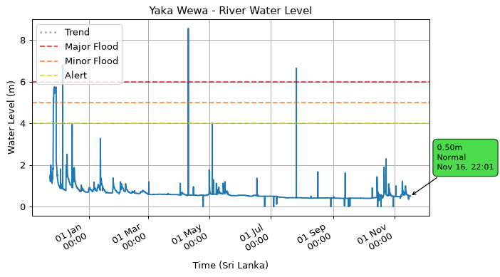

# lk_irrigation 🇱🇰

Realtime Data about *River Water Levels* in Sri Lanka, from the [Irrigation Deptartment](https://www.irrigation.gov.lk)'s [Hydrology and Disaster Management](https://www.irrigation.gov.lk/web/index.php?option=com_content&view=article&id=27&Itemid=128&lang=en) Division.

- [Complete Dataset](data/rwlds) with **318,382 measurements** from **39** stations.
- [Scrape and load logic](src/lk_irrigation/rwld/RiverWaterLevelDataLoadMixin.py)
- [Original Data source](https://www.arcgis.com/apps/dashboards/2cffe83c9ff5497d97375498bdf3ff38)

🇱🇰 River water alerts: No active alerts.
Source: Sri Lanka Irrigation Department https://www.irrigation.gov.lk
Repo: https://github.com/nuuuwan/lk_irrigation
## River Water Level Map

## Latest measurements

*There were **38** measurements in the last **1 hour**.*

| Measured At | Station (River Basin) | Level (m) | Alert Level | Rate-of-Rise (m/hr) | Rising Alert |
| --- | --- | ---: | --- | ---: | --- |
| 2026-11-17 15:19:28 | Pitabeddara (Nilwala Ganga) | 1.19 | 🟢 Normal | -0.012 |  |
| 2026-11-17 15:13:53 | Padiyathalawa (Maduru Oya) | 0.38 | 🟢 Normal | -0.005 |  |
| 2026-11-17 15:10:26 | Panadugama (Nilwala Ganga) | 3.74 | 🟢 Normal | -0.020 |  |
| 2026-11-17 15:09:41 | Baddegama (Gin Ganga) | 1.64 | 🟢 Normal | -0.009 |  |
| 2026-11-17 15:09:08 | Moraketiya (Walawe Ganga) | 1.13 | 🟢 Normal | -0.019 |  |
| 2026-11-17 15:08:43 | Urawa (Nilwala Ganga) | 0.95 | 🟢 Normal | 0.000 |  |
| 2026-11-17 15:08:30 | Rathnapura (Kalu Ganga) | 1.50 | 🟢 Normal | 0.010 | 🔺 Rising |
| 2026-11-17 15:07:16 | Glencourse (Kelani Ganga) | 10.18 | 🟢 Normal | -0.039 |  |
| 2026-11-17 15:07:06 | Magura (Kalu Ganga) | 1.60 | 🟢 Normal | -0.011 |  |
| 2026-11-17 15:07:02 | Holombuwa (Kelani Ganga) | 0.67 | 🟢 Normal | -0.015 |  |
| 2026-11-17 15:06:15 | Thawalama (Gin Ganga) | 1.80 | 🟢 Normal | 0.010 | 🔺 Rising |
| 2026-11-17 15:05:56 | Thalgahagoda (Nilwala Ganga) | 1.09 | 🟢 Normal | -0.010 |  |
| 2026-11-17 15:05:50 | Norwood (Kelani Ganga) | 0.94 | 🟢 Normal | 0.000 |  |
| 2026-11-17 15:05:25 | Ellagawa (Kalu Ganga) | 5.07 | 🟢 Normal | -0.010 |  |
| 2026-11-17 15:05:12 | Peradeniya (Mahaweli Ganga) | 2.67 | 🟢 Normal | -0.020 |  |
| 2026-11-17 15:04:59 | Kalawellawa (Millakanda) (Kalu Ganga) | 2.47 | 🟢 Normal | 0.010 | 🔺 Rising |
| 2026-11-17 15:04:06 | Galgamuwa (Mee Oya) | 0.23 | 🟢 Normal | -0.010 |  |
| 2026-11-17 15:03:42 | Kuda Oya (Kirindi Oya) | 1.56 | 🟢 Normal | -0.010 |  |
| 2026-11-17 15:03:30 | Kithulgala (Kelani Ganga) | 2.15 | 🟢 Normal | 0.000 |  |
| 2026-11-17 15:03:28 | Horowpothana (Yan Oya) | 1.89 | 🟢 Normal | -0.012 |  |
| 2026-11-17 15:03:07 | Badalgama (Maha Oya) | 2.60 | 🟢 Normal | 0.000 |  |
| 2026-11-17 15:02:53 | Hanwella (Kelani Ganga) | 1.97 | 🟢 Normal | -0.010 |  |
| 2026-11-17 15:02:50 | Dunamale (Aththanagalu Oya) | 1.71 | 🟢 Normal | 0.000 |  |
| 2026-11-17 15:02:46 | Moragaswewa (Deduru Oya) | 0.64 | 🟢 Normal | 0.000 |  |
| 2026-11-17 15:02:45 | Thanthirimale (Malwathu Oya) | 1.34 | 🟢 Normal | -0.011 |  |
| 2026-11-17 15:02:45 | Thaldena (Mahaweli Ganga) | 0.50 | 🟢 Normal | 0.000 |  |
| 2026-11-17 15:02:44 | Giriulla (Maha Oya) | 1.33 | 🟢 Normal | 0.000 |  |
| 2026-11-17 15:02:43 | Nawalapitiya (Mahaweli Ganga) | 1.21 | 🟢 Normal | 0.000 |  |
| 2026-11-17 15:02:31 | Wellawaya (Kirindi Oya) | 1.27 | 🟢 Normal | -0.029 |  |
| 2026-11-17 15:02:18 | Manampitiya (Mahaweli Ganga) | 1.12 | 🟢 Normal | 0.000 |  |
| 2026-11-17 15:02:14 | Thanamalwila (Kirindi Oya) | 1.39 | 🟢 Normal | -0.010 |  |
| 2026-11-17 15:02:08 | Yaka Wewa (Ma Oya) | 0.52 | 🟢 Normal | 0.000 |  |
| 2026-11-17 15:01:45 | Deraniyagala (Kelani Ganga) | 0.55 | 🟢 Normal | -0.010 |  |
| 2026-11-17 15:01:40 | Nagalagam Street (Kelani Ganga) | 0.55 | 🟢 Normal | 0.030 | 🔺 Rising |
| 2026-11-17 15:01:12 | Putupaula (Kalu Ganga) | 0.74 | 🟢 Normal | 0.043 | 🔺 Rising |
| 2026-11-17 15:01:10 | Nakkala (Kumbukkan Oya) | 0.87 | 🟢 Normal | -0.010 |  |
| 2026-11-17 15:00:32 | Weraganthota (Mahaweli Ganga) | -2.02 | 🟢 Normal | 0.063 | 🔺 Rising |
| 2026-11-17 15:00:09 | Siyambalanduwa (Heda Oya) | 0.52 | 🟢 Normal | 0.000 |  |

## Latest by Station

*⌛ = Latest measurement is older than **24 hours**.*

| Measured At | Station (River Basin) | Level (m) | Alert Level | Rate-of-Rise (m/hr) | Rising Alert |
| --- | --- | ---: | --- | ---: | --- |
| 2026-11-17 15:00:32 | Weraganthota (Mahaweli Ganga) | -2.02 | 🟢 Normal | 0.063 | 🔺 Rising |
| 2026-11-17 15:01:12 | Putupaula (Kalu Ganga) | 0.74 | 🟢 Normal | 0.043 | 🔺 Rising |
| 2026-11-17 15:01:40 | Nagalagam Street (Kelani Ganga) | 0.55 | 🟢 Normal | 0.030 | 🔺 Rising |
| 2026-11-17 15:08:30 | Rathnapura (Kalu Ganga) | 1.50 | 🟢 Normal | 0.010 | 🔺 Rising |
| 2026-11-17 15:06:15 | Thawalama (Gin Ganga) | 1.80 | 🟢 Normal | 0.010 | 🔺 Rising |
| 2026-11-17 15:04:59 | Kalawellawa (Millakanda) (Kalu Ganga) | 2.47 | 🟢 Normal | 0.010 | 🔺 Rising |
| 2026-11-17 15:03:30 | Kithulgala (Kelani Ganga) | 2.15 | 🟢 Normal | 0.000 |  |
| 2026-11-17 15:02:46 | Moragaswewa (Deduru Oya) | 0.64 | 🟢 Normal | 0.000 |  |
| 2026-11-17 15:02:43 | Nawalapitiya (Mahaweli Ganga) | 1.21 | 🟢 Normal | 0.000 |  |
| 2026-11-17 15:02:08 | Yaka Wewa (Ma Oya) | 0.52 | 🟢 Normal | 0.000 |  |
| 2026-11-17 15:02:44 | Giriulla (Maha Oya) | 1.33 | 🟢 Normal | 0.000 |  |
| 2026-11-17 15:05:50 | Norwood (Kelani Ganga) | 0.94 | 🟢 Normal | 0.000 |  |
| 2026-11-17 15:00:09 | Siyambalanduwa (Heda Oya) | 0.52 | 🟢 Normal | 0.000 |  |
| 2026-11-17 15:02:50 | Dunamale (Aththanagalu Oya) | 1.71 | 🟢 Normal | 0.000 |  |
| 2026-11-17 15:02:45 | Thaldena (Mahaweli Ganga) | 0.50 | 🟢 Normal | 0.000 |  |
| 2026-11-17 14:02:46 | Katharagama (Menik Ganga) | -0.06 | 🟢 Normal | 0.000 |  |
| 2026-11-17 15:03:07 | Badalgama (Maha Oya) | 2.60 | 🟢 Normal | 0.000 |  |
| 2026-11-17 15:02:18 | Manampitiya (Mahaweli Ganga) | 1.12 | 🟢 Normal | 0.000 |  |
| 2026-11-17 15:08:43 | Urawa (Nilwala Ganga) | 0.95 | 🟢 Normal | 0.000 |  |
| 2026-11-17 15:13:53 | Padiyathalawa (Maduru Oya) | 0.38 | 🟢 Normal | -0.005 |  |
| 2026-11-17 15:09:41 | Baddegama (Gin Ganga) | 1.64 | 🟢 Normal | -0.009 |  |
| 2026-11-17 15:05:25 | Ellagawa (Kalu Ganga) | 5.07 | 🟢 Normal | -0.010 |  |
| 2026-11-17 15:02:14 | Thanamalwila (Kirindi Oya) | 1.39 | 🟢 Normal | -0.010 |  |
| 2026-11-17 15:03:42 | Kuda Oya (Kirindi Oya) | 1.56 | 🟢 Normal | -0.010 |  |
| 2026-11-17 15:04:06 | Galgamuwa (Mee Oya) | 0.23 | 🟢 Normal | -0.010 |  |
| 2026-11-17 15:02:53 | Hanwella (Kelani Ganga) | 1.97 | 🟢 Normal | -0.010 |  |
| 2026-11-17 15:01:10 | Nakkala (Kumbukkan Oya) | 0.87 | 🟢 Normal | -0.010 |  |
| 2026-11-17 15:01:45 | Deraniyagala (Kelani Ganga) | 0.55 | 🟢 Normal | -0.010 |  |
| 2026-11-17 15:05:56 | Thalgahagoda (Nilwala Ganga) | 1.09 | 🟢 Normal | -0.010 |  |
| 2026-11-17 15:02:45 | Thanthirimale (Malwathu Oya) | 1.34 | 🟢 Normal | -0.011 |  |
| 2026-11-17 15:07:06 | Magura (Kalu Ganga) | 1.60 | 🟢 Normal | -0.011 |  |
| 2026-11-17 15:03:28 | Horowpothana (Yan Oya) | 1.89 | 🟢 Normal | -0.012 |  |
| 2026-11-17 15:19:28 | Pitabeddara (Nilwala Ganga) | 1.19 | 🟢 Normal | -0.012 |  |
| 2026-11-17 15:07:02 | Holombuwa (Kelani Ganga) | 0.67 | 🟢 Normal | -0.015 |  |
| 2026-11-17 15:09:08 | Moraketiya (Walawe Ganga) | 1.13 | 🟢 Normal | -0.019 |  |
| 2026-11-17 15:10:26 | Panadugama (Nilwala Ganga) | 3.74 | 🟢 Normal | -0.020 |  |
| 2026-11-17 15:05:12 | Peradeniya (Mahaweli Ganga) | 2.67 | 🟢 Normal | -0.020 |  |
| 2026-11-17 15:02:31 | Wellawaya (Kirindi Oya) | 1.27 | 🟢 Normal | -0.029 |  |
| 2026-11-17 15:07:16 | Glencourse (Kelani Ganga) | 10.18 | 🟢 Normal | -0.039 |  |

## River Water Level Charts by Station

### Weraganthota (Mahaweli Ganga)

### Putupaula (Kalu Ganga)

### Nagalagam Street (Kelani Ganga)

### Rathnapura (Kalu Ganga)

### Thawalama (Gin Ganga)

### Kalawellawa (Millakanda) (Kalu Ganga)

.png)

### Kithulgala (Kelani Ganga)

### Moragaswewa (Deduru Oya)

### Nawalapitiya (Mahaweli Ganga)

### Yaka Wewa (Ma Oya)

### Giriulla (Maha Oya)

### Norwood (Kelani Ganga)

### Siyambalanduwa (Heda Oya)

### Dunamale (Aththanagalu Oya)

### Thaldena (Mahaweli Ganga)

### Katharagama (Menik Ganga)

### Badalgama (Maha Oya)

### Manampitiya (Mahaweli Ganga)

### Urawa (Nilwala Ganga)

### Padiyathalawa (Maduru Oya)

### Baddegama (Gin Ganga)

### Ellagawa (Kalu Ganga)

### Thanamalwila (Kirindi Oya)

### Kuda Oya (Kirindi Oya)

### Galgamuwa (Mee Oya)

### Hanwella (Kelani Ganga)

### Nakkala (Kumbukkan Oya)

### Deraniyagala (Kelani Ganga)

### Thalgahagoda (Nilwala Ganga)

### Thanthirimale (Malwathu Oya)

### Magura (Kalu Ganga)

### Horowpothana (Yan Oya)

### Pitabeddara (Nilwala Ganga)

### Holombuwa (Kelani Ganga)

### Moraketiya (Walawe Ganga)

### Panadugama (Nilwala Ganga)

### Peradeniya (Mahaweli Ganga)

### Wellawaya (Kirindi Oya)

### Glencourse (Kelani Ganga)

